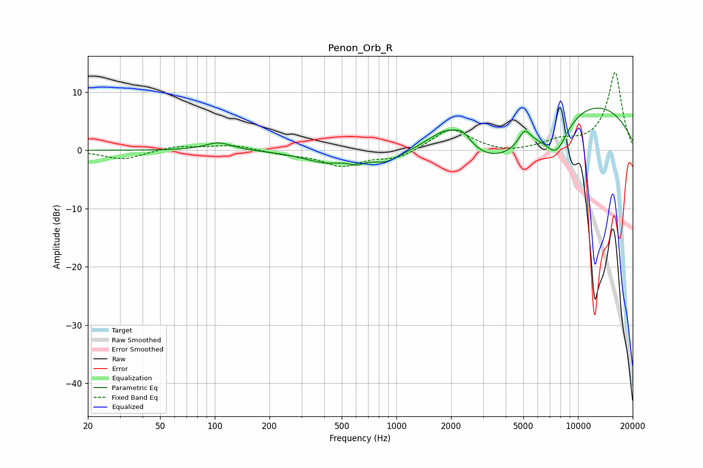

# Penon_Orb_R
See [usage instructions](https://github.com/jaakkopasanen/AutoEq#usage) for more options and info.

### Parametric EQs
Apply preamp of -7.3 dB when using parametric equalizer.

|   # | Type    |   Fc (Hz) |    Q |   Gain (dB) |
|-----|---------|-----------|------|-------------|
|   1 | Peaking |       105 | 1.9  |         1.4 |
|   2 | Peaking |       413 | 1.09 |        -2   |
|   3 | Peaking |       605 | 3.73 |        -0.9 |
|   4 | Peaking |       878 | 1.75 |        -1.8 |
|   5 | Peaking |      1924 | 1.27 |         4.9 |
|   6 | Peaking |      2336 | 3.48 |         1.5 |
|   7 | Peaking |      3559 | 0.61 |        -6.8 |
|   8 | Peaking |      5085 | 4.2  |         2.7 |
|   9 | Peaking |      7581 | 1.95 |        -5.8 |
|  10 | Peaking |     10000 | 0.29 |         9   |

### Fixed Band EQs
When using fixed band (also called graphic) equalizer, apply preamp of **-13.5 dB** (if available) and set gains manually with these parameters.

|   # | Type    |   Fc (Hz) |    Q |   Gain (dB) |
|-----|---------|-----------|------|-------------|
|   1 | Peaking |        31 | 1.41 |        -1.6 |
|   2 | Peaking |        62 | 1.41 |         0.7 |
|   3 | Peaking |       125 | 1.41 |         0.9 |
|   4 | Peaking |       250 | 1.41 |        -0.6 |
|   5 | Peaking |       500 | 1.41 |        -2.6 |
|   6 | Peaking |      1000 | 1.41 |        -1.4 |
|   7 | Peaking |      2000 | 1.41 |         3.8 |
|   8 | Peaking |      4000 | 1.41 |        -0.6 |
|   9 | Peaking |      8000 | 1.41 |         1.4 |
|  10 | Peaking |     16000 | 1.41 |        13.4 |

### Graphs

