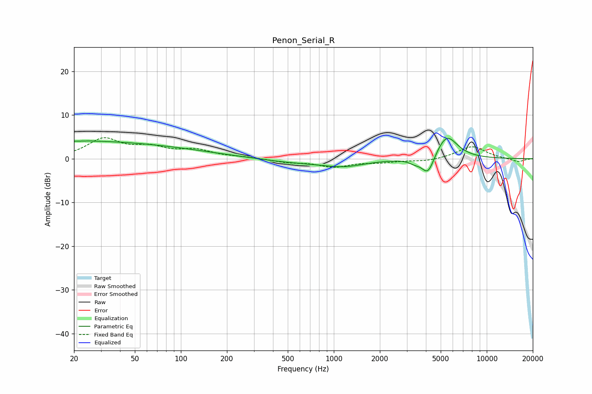

# Penon_Serial_R
See [usage instructions](https://github.com/jaakkopasanen/AutoEq#usage) for more options and info.

### Parametric EQs
Apply preamp of -4.7 dB when using parametric equalizer.

|   # | Type    |   Fc (Hz) |    Q |   Gain (dB) |
|-----|---------|-----------|------|-------------|
|   1 | Peaking |        20 | 0.26 |         3.9 |
|   2 | Peaking |        27 | 5.91 |         3.1 |
|   3 | Peaking |        27 | 5.98 |        -3   |
|   4 | Peaking |       108 | 0.48 |         1   |
|   5 | Peaking |       528 | 0.72 |        -0.7 |
|   6 | Peaking |      1188 | 0.92 |        -1.8 |
|   7 | Peaking |      1514 | 1.22 |         0.2 |
|   8 | Peaking |      3381 | 3.61 |        -0.8 |
|   9 | Peaking |      4130 | 3.39 |        -4.5 |
|  10 | Peaking |      5470 | 1.97 |         5.6 |

### Fixed Band EQs
When using fixed band (also called graphic) equalizer, apply preamp of **-4.9 dB** (if available) and set gains manually with these parameters.

|   # | Type    |   Fc (Hz) |    Q |   Gain (dB) |
|-----|---------|-----------|------|-------------|
|   1 | Peaking |        31 | 1.41 |         4.3 |
|   2 | Peaking |        62 | 1.41 |         2.2 |
|   3 | Peaking |       125 | 1.41 |         1.8 |
|   4 | Peaking |       250 | 1.41 |         0.3 |
|   5 | Peaking |       500 | 1.41 |        -0.7 |
|   6 | Peaking |      1000 | 1.41 |        -1.7 |
|   7 | Peaking |      2000 | 1.41 |        -0.7 |
|   8 | Peaking |      4000 | 1.41 |        -0.6 |
|   9 | Peaking |      8000 | 1.41 |         2.9 |
|  10 | Peaking |     16000 | 1.41 |        -0.8 |

### Graphs

