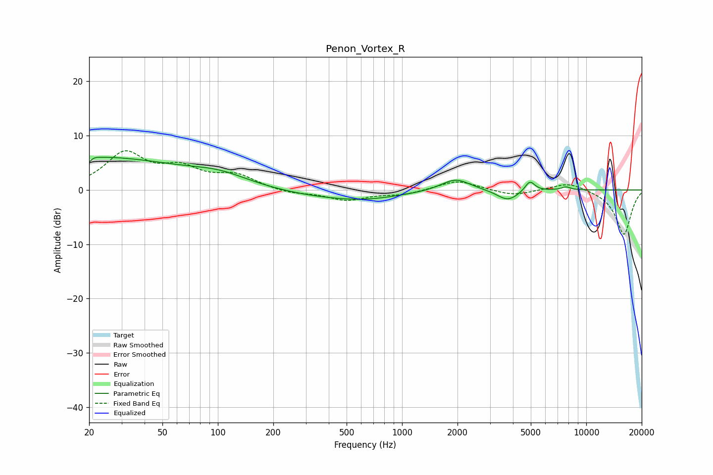

# Penon_Vortex_R
See [usage instructions](https://github.com/jaakkopasanen/AutoEq#usage) for more options and info.

### Parametric EQs
Apply preamp of -6.1 dB when using parametric equalizer.

|   # | Type    |   Fc (Hz) |    Q |   Gain (dB) |
|-----|---------|-----------|------|-------------|
|   1 | Peaking |        20 | 5.97 |        -4.3 |
|   2 | Peaking |        20 | 5.56 |         3.5 |
|   3 | Peaking |        21 | 0.28 |         6   |
|   4 | Peaking |       102 | 0.9  |         1.7 |
|   5 | Peaking |       292 | 0.66 |        -0.7 |
|   6 | Peaking |       610 | 0.66 |        -1.6 |
|   7 | Peaking |      1953 | 1.78 |         2.3 |
|   8 | Peaking |      3750 | 2.41 |        -2   |
|   9 | Peaking |      4941 | 5.2  |         2   |
|  10 | Peaking |      7763 | 5.18 |         0.6 |

### Fixed Band EQs
When using fixed band (also called graphic) equalizer, apply preamp of **-7.3 dB** (if available) and set gains manually with these parameters.

|   # | Type    |   Fc (Hz) |    Q |   Gain (dB) |
|-----|---------|-----------|------|-------------|
|   1 | Peaking |        31 | 1.41 |         6.5 |
|   2 | Peaking |        62 | 1.41 |         3.4 |
|   3 | Peaking |       125 | 1.41 |         2.5 |
|   4 | Peaking |       250 | 1.41 |        -0.7 |
|   5 | Peaking |       500 | 1.41 |        -1.8 |
|   6 | Peaking |      1000 | 1.41 |        -0.8 |
|   7 | Peaking |      2000 | 1.41 |         1.8 |
|   8 | Peaking |      4000 | 1.41 |        -1.1 |
|   9 | Peaking |      8000 | 1.41 |         1.5 |
|  10 | Peaking |     16000 | 1.41 |        -8.3 |

### Graphs

