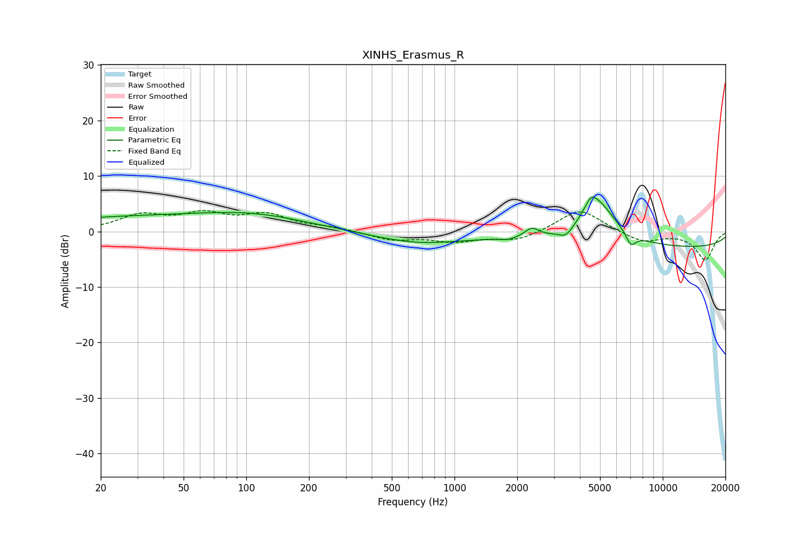

# XINHS_Erasmus_R
See [usage instructions](https://github.com/jaakkopasanen/AutoEq#usage) for more options and info.

### Parametric EQs
Apply preamp of -6.3 dB when using parametric equalizer.

|   # | Type    |   Fc (Hz) |    Q |   Gain (dB) |
|-----|---------|-----------|------|-------------|
|   1 | Peaking |        41 | 0.21 |         2.7 |
|   2 | Peaking |       107 | 0.64 |         1.1 |
|   3 | Peaking |       665 | 0.65 |        -2   |
|   4 | Peaking |      1813 | 4.33 |        -0.4 |
|   5 | Peaking |      2352 | 4.21 |         1.7 |
|   6 | Peaking |      3440 | 3.98 |        -1.7 |
|   7 | Peaking |      4525 | 5.15 |         1.9 |
|   8 | Peaking |      4861 | 1.52 |         7.6 |
|   9 | Peaking |      7031 | 5.76 |        -2.2 |
|  10 | Peaking |     10000 | 0.18 |        -3   |

### Fixed Band EQs
When using fixed band (also called graphic) equalizer, apply preamp of **-3.9 dB** (if available) and set gains manually with these parameters.

|   # | Type    |   Fc (Hz) |    Q |   Gain (dB) |
|-----|---------|-----------|------|-------------|
|   1 | Peaking |        31 | 1.41 |         2.7 |
|   2 | Peaking |        62 | 1.41 |         2.8 |
|   3 | Peaking |       125 | 1.41 |         2.8 |
|   4 | Peaking |       250 | 1.41 |         0.7 |
|   5 | Peaking |       500 | 1.41 |        -1.5 |
|   6 | Peaking |      1000 | 1.41 |        -1.6 |
|   7 | Peaking |      2000 | 1.41 |        -1.6 |
|   8 | Peaking |      4000 | 1.41 |         4.2 |
|   9 | Peaking |      8000 | 1.41 |        -1.9 |
|  10 | Peaking |     16000 | 1.41 |        -5.1 |

### Graphs

