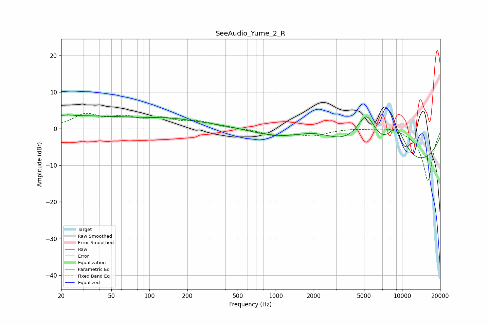

# SeeAudio_Yume_2_R
See [usage instructions](https://github.com/jaakkopasanen/AutoEq#usage) for more options and info.

### Parametric EQs
Apply preamp of -3.9 dB when using parametric equalizer.

|   # | Type    |   Fc (Hz) |    Q |   Gain (dB) |
|-----|---------|-----------|------|-------------|
|   1 | Peaking |        21 | 0.19 |         3.5 |
|   2 | Peaking |        22 | 5.38 |        -0.5 |
|   3 | Peaking |        22 | 4.47 |         0.7 |
|   4 | Peaking |       145 | 0.89 |         0.7 |
|   5 | Peaking |       780 | 0.2  |         2.5 |
|   6 | Peaking |      2089 | 0.67 |         6.5 |
|   7 | Peaking |      2659 | 0.24 |        -3.6 |
|   8 | Peaking |      5233 | 0.97 |        19.9 |
|   9 | Peaking |      6513 | 0.26 |       -20   |
|  10 | Peaking |      9026 | 1.33 |        11.5 |

### Fixed Band EQs
When using fixed band (also called graphic) equalizer, apply preamp of **-4.3 dB** (if available) and set gains manually with these parameters.

|   # | Type    |   Fc (Hz) |    Q |   Gain (dB) |
|-----|---------|-----------|------|-------------|
|   1 | Peaking |        31 | 1.41 |         3.6 |
|   2 | Peaking |        62 | 1.41 |         2.6 |
|   3 | Peaking |       125 | 1.41 |         2.4 |
|   4 | Peaking |       250 | 1.41 |         1.7 |
|   5 | Peaking |       500 | 1.41 |         0   |
|   6 | Peaking |      1000 | 1.41 |        -1.7 |
|   7 | Peaking |      2000 | 1.41 |        -1.7 |
|   8 | Peaking |      4000 | 1.41 |         0.2 |
|   9 | Peaking |      8000 | 1.41 |         0.8 |
|  10 | Peaking |     16000 | 1.41 |       -14.3 |

### Graphs

