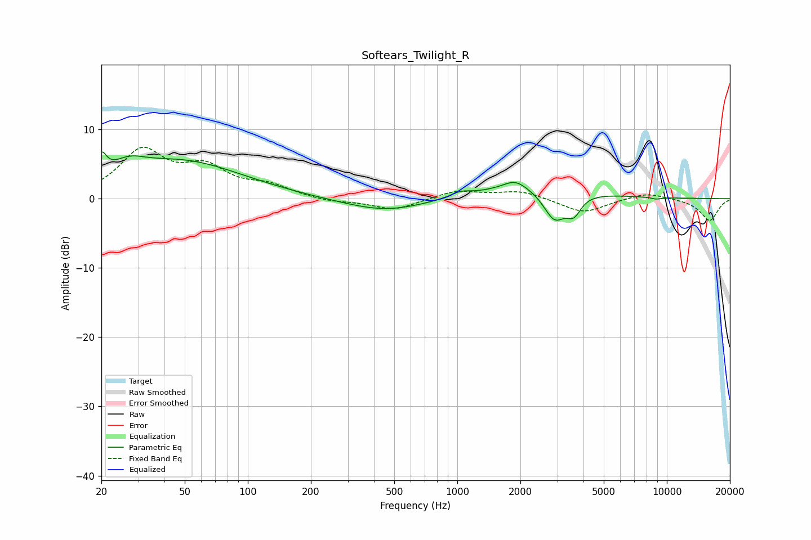

# Softears_Twilight_R
See [usage instructions](https://github.com/jaakkopasanen/AutoEq#usage) for more options and info.

### Parametric EQs
Apply preamp of -6.8 dB when using parametric equalizer.

|   # | Type    |   Fc (Hz) |    Q |   Gain (dB) |
|-----|---------|-----------|------|-------------|
|   1 | Peaking |        20 | 5.96 |         3   |
|   2 | Peaking |        27 | 1.77 |         2   |
|   3 | Peaking |        48 | 0.48 |         5.3 |
|   4 | Peaking |       453 | 0.72 |        -1.9 |
|   5 | Peaking |      1033 | 3.08 |         0.7 |
|   6 | Peaking |      1886 | 2.67 |         1.3 |
|   7 | Peaking |      2268 | 0.57 |         2.1 |
|   8 | Peaking |      2910 | 2.64 |        -4.5 |
|   9 | Peaking |      3600 | 4.15 |        -2.5 |
|  10 | Peaking |      8896 | 5.78 |        -0.3 |

### Fixed Band EQs
When using fixed band (also called graphic) equalizer, apply preamp of **-7.5 dB** (if available) and set gains manually with these parameters.

|   # | Type    |   Fc (Hz) |    Q |   Gain (dB) |
|-----|---------|-----------|------|-------------|
|   1 | Peaking |        31 | 1.41 |         6.6 |
|   2 | Peaking |        62 | 1.41 |         3.9 |
|   3 | Peaking |       125 | 1.41 |         1.6 |
|   4 | Peaking |       250 | 1.41 |        -0.5 |
|   5 | Peaking |       500 | 1.41 |        -1.6 |
|   6 | Peaking |      1000 | 1.41 |         1.2 |
|   7 | Peaking |      2000 | 1.41 |         1.1 |
|   8 | Peaking |      4000 | 1.41 |        -2.1 |
|   9 | Peaking |      8000 | 1.41 |         1   |
|  10 | Peaking |     16000 | 1.41 |        -3.2 |

### Graphs

