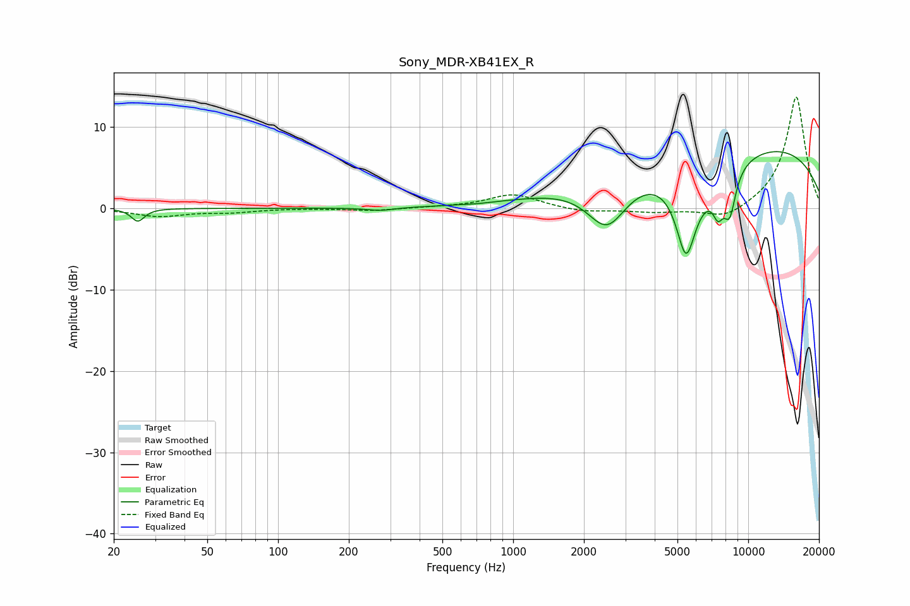

# Sony_MDR-XB41EX_R
See [usage instructions](https://github.com/jaakkopasanen/AutoEq#usage) for more options and info.

### Parametric EQs
Apply preamp of -7.1 dB when using parametric equalizer.

|   # | Type    |   Fc (Hz) |    Q |   Gain (dB) |
|-----|---------|-----------|------|-------------|
|   1 | Peaking |        25 | 5.22 |        -1.6 |
|   2 | Peaking |       273 | 2.54 |        -0.4 |
|   3 | Peaking |       647 | 4.22 |         0   |
|   4 | Peaking |       689 | 2.74 |        -0.1 |
|   5 | Peaking |      2509 | 1.61 |        -6.2 |
|   6 | Peaking |      5439 | 3.26 |        -8.9 |
|   7 | Peaking |      6389 | 0.98 |        -3.8 |
|   8 | Peaking |      7446 | 5.66 |        -3.1 |
|   9 | Peaking |      8340 | 4.93 |        -5   |
|  10 | Peaking |      9013 | 0.2  |         8.4 |

### Fixed Band EQs
When using fixed band (also called graphic) equalizer, apply preamp of **-13.8 dB** (if available) and set gains manually with these parameters.

|   # | Type    |   Fc (Hz) |    Q |   Gain (dB) |
|-----|---------|-----------|------|-------------|
|   1 | Peaking |        31 | 1.41 |        -0.9 |
|   2 | Peaking |        62 | 1.41 |        -0.4 |
|   3 | Peaking |       125 | 1.41 |         0   |
|   4 | Peaking |       250 | 1.41 |        -0.3 |
|   5 | Peaking |       500 | 1.41 |         0.1 |
|   6 | Peaking |      1000 | 1.41 |         1.7 |
|   7 | Peaking |      2000 | 1.41 |        -0.5 |
|   8 | Peaking |      4000 | 1.41 |        -0.5 |
|   9 | Peaking |      8000 | 1.41 |        -1.5 |
|  10 | Peaking |     16000 | 1.41 |        13.9 |

### Graphs

