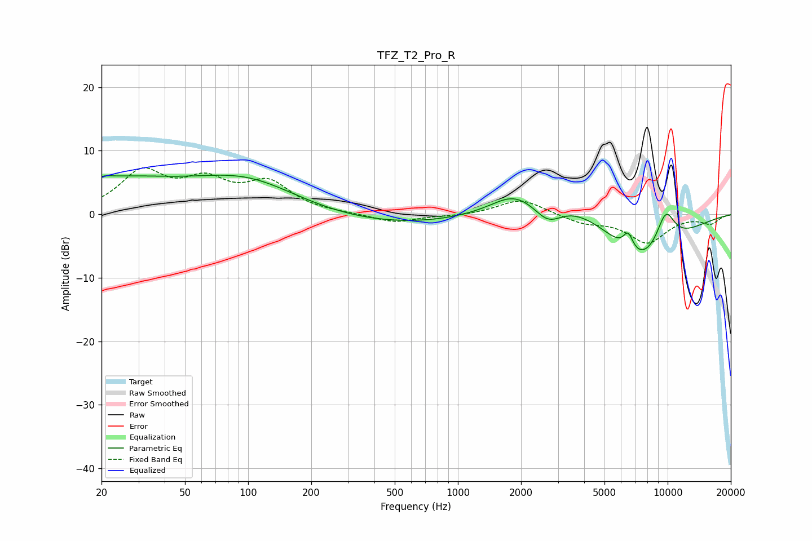

# TFZ_T2_Pro_R
See [usage instructions](https://github.com/jaakkopasanen/AutoEq#usage) for more options and info.

### Parametric EQs
Apply preamp of -6.2 dB when using parametric equalizer.

|   # | Type    |   Fc (Hz) |    Q |   Gain (dB) |
|-----|---------|-----------|------|-------------|
|   1 | Peaking |        21 | 4.18 |         0.4 |
|   2 | Peaking |        22 | 0.46 |         4.8 |
|   3 | Peaking |        99 | 0.51 |         6.6 |
|   4 | Peaking |       270 | 0.21 |        -2.4 |
|   5 | Peaking |      1832 | 1.39 |         2.4 |
|   6 | Peaking |      2692 | 2.07 |        -3.2 |
|   7 | Peaking |      3382 | 0.56 |         4   |
|   8 | Peaking |      6485 | 5.79 |         2.8 |
|   9 | Peaking |      7479 | 0.74 |        -9.3 |
|  10 | Peaking |      9773 | 2.57 |         6   |

### Fixed Band EQs
When using fixed band (also called graphic) equalizer, apply preamp of **-7.4 dB** (if available) and set gains manually with these parameters.

|   # | Type    |   Fc (Hz) |    Q |   Gain (dB) |
|-----|---------|-----------|------|-------------|
|   1 | Peaking |        31 | 1.41 |         6.3 |
|   2 | Peaking |        62 | 1.41 |         4.4 |
|   3 | Peaking |       125 | 1.41 |         4.6 |
|   4 | Peaking |       250 | 1.41 |         0   |
|   5 | Peaking |       500 | 1.41 |        -1.4 |
|   6 | Peaking |      1000 | 1.41 |        -0.3 |
|   7 | Peaking |      2000 | 1.41 |         2.5 |
|   8 | Peaking |      4000 | 1.41 |        -1.3 |
|   9 | Peaking |      8000 | 1.41 |        -4.4 |
|  10 | Peaking |     16000 | 1.41 |        -1.4 |

### Graphs

