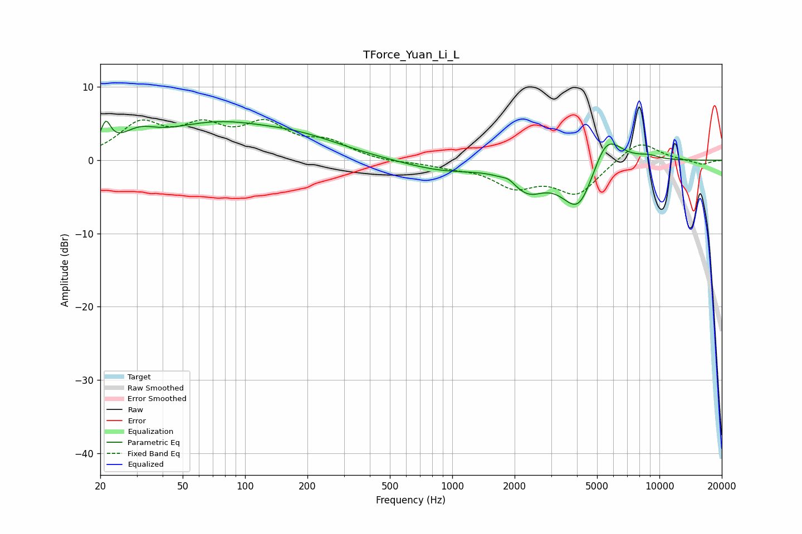

# TForce_Yuan_Li_L
See [usage instructions](https://github.com/jaakkopasanen/AutoEq#usage) for more options and info.

### Parametric EQs
Apply preamp of -5.4 dB when using parametric equalizer.

|   # | Type    |   Fc (Hz) |    Q |   Gain (dB) |
|-----|---------|-----------|------|-------------|
|   1 | Peaking |        21 | 6    |         3.2 |
|   2 | Peaking |        31 | 1.76 |         2   |
|   3 | Peaking |        70 | 0.52 |         4.4 |
|   4 | Peaking |       188 | 0.65 |         2.1 |
|   5 | Peaking |       903 | 0.73 |        -1.4 |
|   6 | Peaking |      1870 | 5.54 |         0.5 |
|   7 | Peaking |      2325 | 1.76 |        -3.2 |
|   8 | Peaking |      4089 | 1.65 |        -7.3 |
|   9 | Peaking |      5519 | 1.85 |         5.4 |
|  10 | Peaking |      8833 | 2.36 |         0.6 |

### Fixed Band EQs
When using fixed band (also called graphic) equalizer, apply preamp of **-5.7 dB** (if available) and set gains manually with these parameters.

|   # | Type    |   Fc (Hz) |    Q |   Gain (dB) |
|-----|---------|-----------|------|-------------|
|   1 | Peaking |        31 | 1.41 |         4.6 |
|   2 | Peaking |        62 | 1.41 |         3.8 |
|   3 | Peaking |       125 | 1.41 |         4.3 |
|   4 | Peaking |       250 | 1.41 |         2.1 |
|   5 | Peaking |       500 | 1.41 |        -0.3 |
|   6 | Peaking |      1000 | 1.41 |        -0.7 |
|   7 | Peaking |      2000 | 1.41 |        -3.2 |
|   8 | Peaking |      4000 | 1.41 |        -4.4 |
|   9 | Peaking |      8000 | 1.41 |         2.8 |
|  10 | Peaking |     16000 | 1.41 |        -0.6 |

### Graphs

