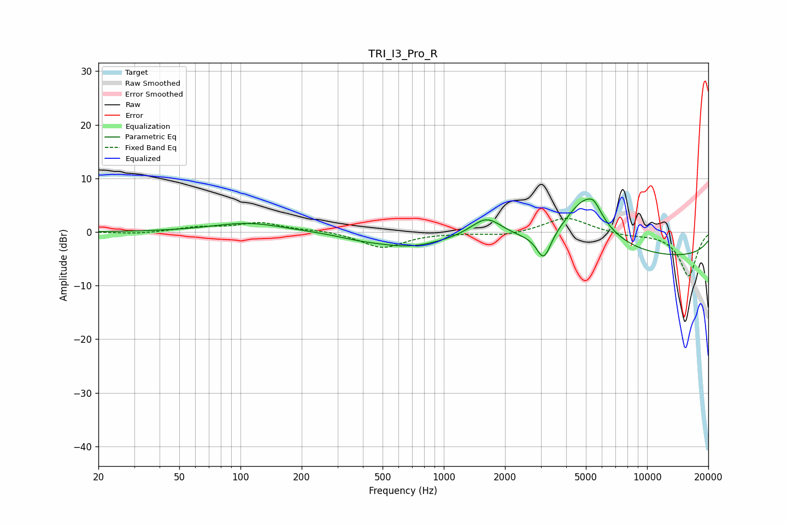

# TRI_I3_Pro_R
See [usage instructions](https://github.com/jaakkopasanen/AutoEq#usage) for more options and info.

### Parametric EQs
Apply preamp of -6.3 dB when using parametric equalizer.

|   # | Type    |   Fc (Hz) |    Q |   Gain (dB) |
|-----|---------|-----------|------|-------------|
|   1 | Peaking |       109 | 0.81 |         1.7 |
|   2 | Peaking |       389 | 1.24 |        -0.7 |
|   3 | Peaking |       676 | 0.85 |        -2.4 |
|   4 | Peaking |      1624 | 1.78 |         4.1 |
|   5 | Peaking |      2666 | 1.95 |         0.1 |
|   6 | Peaking |      3103 | 3.95 |        -5.2 |
|   7 | Peaking |      4914 | 1.31 |         9.6 |
|   8 | Peaking |      5504 | 4.74 |         2.4 |
|   9 | Peaking |      5552 | 5.93 |        -0.6 |
|  10 | Peaking |     10000 | 0.18 |        -4.9 |

### Fixed Band EQs
When using fixed band (also called graphic) equalizer, apply preamp of **-2.6 dB** (if available) and set gains manually with these parameters.

|   # | Type    |   Fc (Hz) |    Q |   Gain (dB) |
|-----|---------|-----------|------|-------------|
|   1 | Peaking |        31 | 1.41 |        -0.4 |
|   2 | Peaking |        62 | 1.41 |         0.8 |
|   3 | Peaking |       125 | 1.41 |         1.7 |
|   4 | Peaking |       250 | 1.41 |         0.3 |
|   5 | Peaking |       500 | 1.41 |        -3   |
|   6 | Peaking |      1000 | 1.41 |        -0.1 |
|   7 | Peaking |      2000 | 1.41 |        -0.7 |
|   8 | Peaking |      4000 | 1.41 |         2.8 |
|   9 | Peaking |      8000 | 1.41 |        -0.6 |
|  10 | Peaking |     16000 | 1.41 |        -8.2 |

### Graphs

