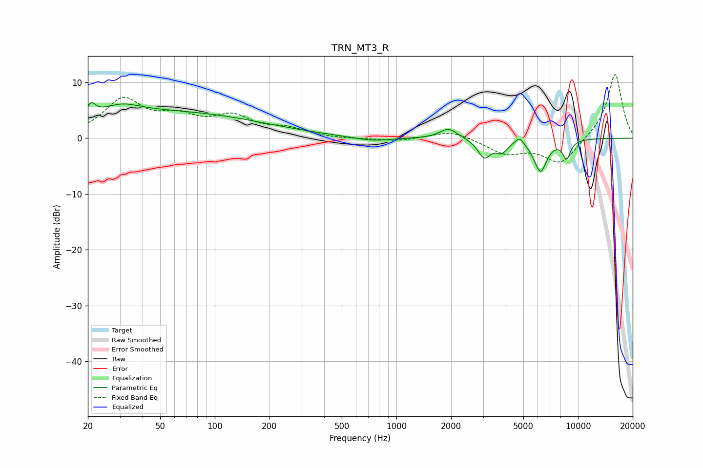

# TRN_MT3_R
See [usage instructions](https://github.com/jaakkopasanen/AutoEq#usage) for more options and info.

### Parametric EQs
Apply preamp of -6.5 dB when using parametric equalizer.

|   # | Type    |   Fc (Hz) |    Q |   Gain (dB) |
|-----|---------|-----------|------|-------------|
|   1 | Peaking |        21 | 6    |         2   |
|   2 | Peaking |        31 | 1.4  |         1.8 |
|   3 | Peaking |        53 | 0.26 |         4.6 |
|   4 | Peaking |       734 | 1.43 |        -0.7 |
|   5 | Peaking |      1939 | 2.9  |         1.9 |
|   6 | Peaking |      3047 | 3.99 |        -3.3 |
|   7 | Peaking |      3800 | 4.41 |        -1.9 |
|   8 | Peaking |      4769 | 5.99 |         1.4 |
|   9 | Peaking |      6206 | 3.74 |        -5.8 |
|  10 | Peaking |      8653 | 6    |        -3.2 |

### Fixed Band EQs
When using fixed band (also called graphic) equalizer, apply preamp of **-11.5 dB** (if available) and set gains manually with these parameters.

|   # | Type    |   Fc (Hz) |    Q |   Gain (dB) |
|-----|---------|-----------|------|-------------|
|   1 | Peaking |        31 | 1.41 |         6.6 |
|   2 | Peaking |        62 | 1.41 |         3.1 |
|   3 | Peaking |       125 | 1.41 |         3.4 |
|   4 | Peaking |       250 | 1.41 |         1.5 |
|   5 | Peaking |       500 | 1.41 |        -0.2 |
|   6 | Peaking |      1000 | 1.41 |        -0.5 |
|   7 | Peaking |      2000 | 1.41 |         1.4 |
|   8 | Peaking |      4000 | 1.41 |        -2.6 |
|   9 | Peaking |      8000 | 1.41 |        -4.6 |
|  10 | Peaking |     16000 | 1.41 |        11.8 |

### Graphs

