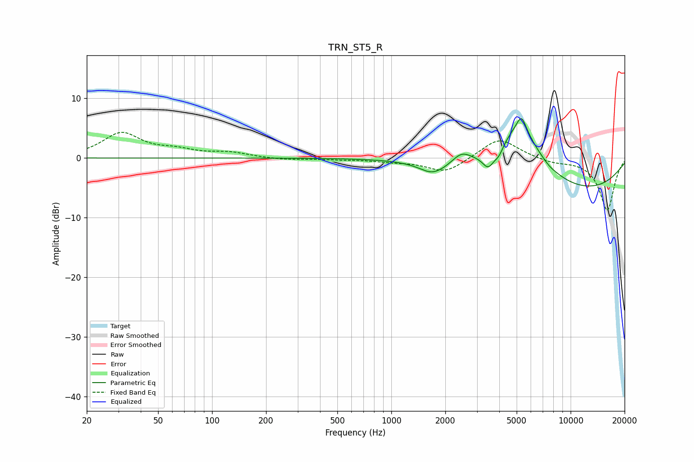

# TRN_ST5_R
See [usage instructions](https://github.com/jaakkopasanen/AutoEq#usage) for more options and info.

### Parametric EQs
Apply preamp of -6.7 dB when using parametric equalizer.

|   # | Type    |   Fc (Hz) |    Q |   Gain (dB) |
|-----|---------|-----------|------|-------------|
|   1 | Peaking |      1543 | 2.01 |         0.4 |
|   2 | Peaking |      1659 | 1.97 |        -1.9 |
|   3 | Peaking |      2014 | 1.13 |        -1.1 |
|   4 | Peaking |      2454 | 2.47 |         2.2 |
|   5 | Peaking |      3481 | 4.24 |        -2.6 |
|   6 | Peaking |      3986 | 5.94 |        -1.3 |
|   7 | Peaking |      5202 | 1.13 |         9   |
|   8 | Peaking |      5318 | 5.41 |         2.6 |
|   9 | Peaking |      7641 | 5.28 |        -0.2 |
|  10 | Peaking |     10000 | 0.31 |        -5.9 |

### Fixed Band EQs
When using fixed band (also called graphic) equalizer, apply preamp of **-4.4 dB** (if available) and set gains manually with these parameters.

|   # | Type    |   Fc (Hz) |    Q |   Gain (dB) |
|-----|---------|-----------|------|-------------|
|   1 | Peaking |        31 | 1.41 |         4.1 |
|   2 | Peaking |        62 | 1.41 |         1.1 |
|   3 | Peaking |       125 | 1.41 |         0.8 |
|   4 | Peaking |       250 | 1.41 |        -0.3 |
|   5 | Peaking |       500 | 1.41 |        -0.2 |
|   6 | Peaking |      1000 | 1.41 |        -0.5 |
|   7 | Peaking |      2000 | 1.41 |        -2.5 |
|   8 | Peaking |      4000 | 1.41 |         3.5 |
|   9 | Peaking |      8000 | 1.41 |        -0.7 |
|  10 | Peaking |     16000 | 1.41 |        -8.8 |

### Graphs

