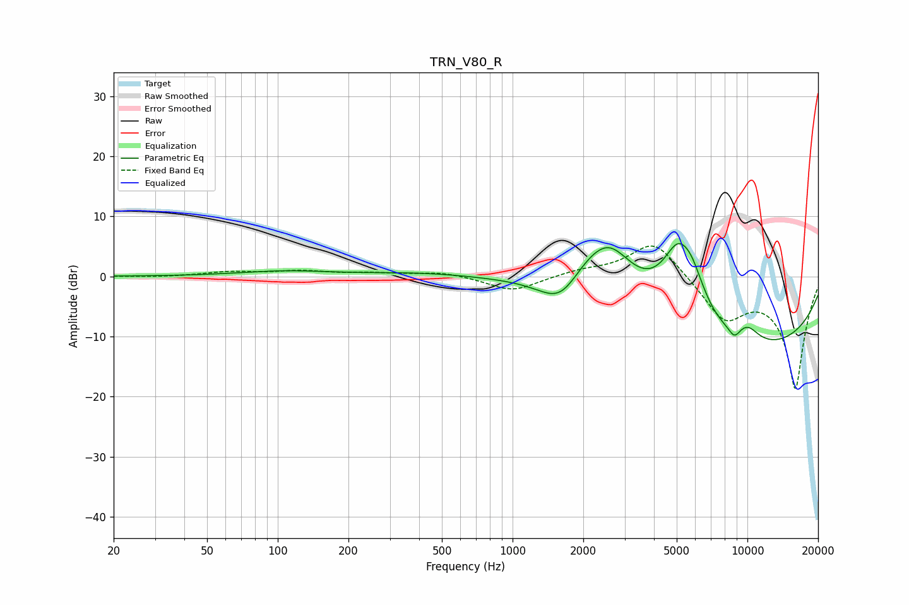

# TRN_V80_R
See [usage instructions](https://github.com/jaakkopasanen/AutoEq#usage) for more options and info.

### Parametric EQs
Apply preamp of -5.6 dB when using parametric equalizer.

|   # | Type    |   Fc (Hz) |    Q |   Gain (dB) |
|-----|---------|-----------|------|-------------|
|   1 | Peaking |       108 | 0.73 |         0.8 |
|   2 | Peaking |       408 | 0.64 |         0.6 |
|   3 | Peaking |      1619 | 1.36 |        -7.5 |
|   4 | Peaking |      2020 | 0.9  |         8   |
|   5 | Peaking |      2605 | 1.44 |         6.3 |
|   6 | Peaking |      5050 | 1.77 |        10.9 |
|   7 | Peaking |      5813 | 2.47 |         4.8 |
|   8 | Peaking |      8808 | 5.36 |        -1.7 |
|   9 | Peaking |      9232 | 0.22 |       -12.6 |
|  10 | Peaking |     10000 | 2.36 |         2.6 |

### Fixed Band EQs
When using fixed band (also called graphic) equalizer, apply preamp of **-5.1 dB** (if available) and set gains manually with these parameters.

|   # | Type    |   Fc (Hz) |    Q |   Gain (dB) |
|-----|---------|-----------|------|-------------|
|   1 | Peaking |        31 | 1.41 |        -0.1 |
|   2 | Peaking |        62 | 1.41 |         0.7 |
|   3 | Peaking |       125 | 1.41 |         0.8 |
|   4 | Peaking |       250 | 1.41 |         0.5 |
|   5 | Peaking |       500 | 1.41 |         0.7 |
|   6 | Peaking |      1000 | 1.41 |        -2.6 |
|   7 | Peaking |      2000 | 1.41 |         0.9 |
|   8 | Peaking |      4000 | 1.41 |         6.3 |
|   9 | Peaking |      8000 | 1.41 |        -6.7 |
|  10 | Peaking |     16000 | 1.41 |       -18.5 |

### Graphs

