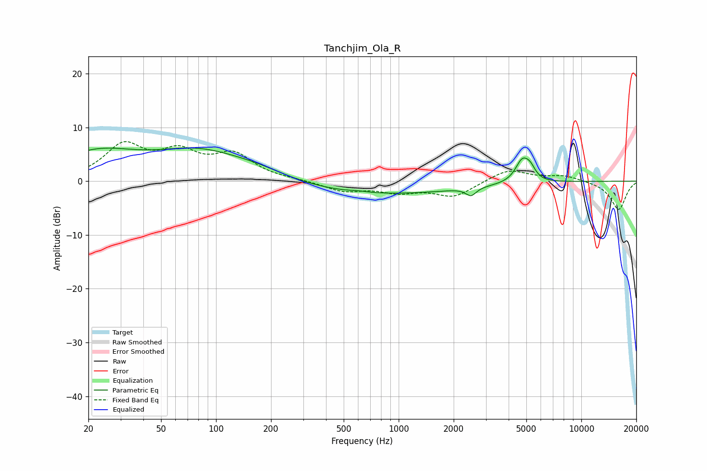

# Tanchjim_Ola_R
See [usage instructions](https://github.com/jaakkopasanen/AutoEq#usage) for more options and info.

### Parametric EQs
Apply preamp of -6.3 dB when using parametric equalizer.

|   # | Type    |   Fc (Hz) |    Q |   Gain (dB) |
|-----|---------|-----------|------|-------------|
|   1 | Peaking |        22 | 0.63 |         5   |
|   2 | Peaking |        79 | 0.61 |         4.7 |
|   3 | Peaking |       170 | 0.72 |         1.9 |
|   4 | Peaking |       258 | 3.35 |        -0.1 |
|   5 | Peaking |       602 | 3.01 |         0.2 |
|   6 | Peaking |       703 | 0.28 |        -2.5 |
|   7 | Peaking |      2490 | 5.1  |        -1.5 |
|   8 | Peaking |      4744 | 3.59 |         4.5 |
|   9 | Peaking |      5054 | 2.5  |        -1.1 |
|  10 | Peaking |      5243 | 4.44 |         2.4 |

### Fixed Band EQs
When using fixed band (also called graphic) equalizer, apply preamp of **-7.5 dB** (if available) and set gains manually with these parameters.

|   # | Type    |   Fc (Hz) |    Q |   Gain (dB) |
|-----|---------|-----------|------|-------------|
|   1 | Peaking |        31 | 1.41 |         6.3 |
|   2 | Peaking |        62 | 1.41 |         4.6 |
|   3 | Peaking |       125 | 1.41 |         4.5 |
|   4 | Peaking |       250 | 1.41 |         0.2 |
|   5 | Peaking |       500 | 1.41 |        -1.8 |
|   6 | Peaking |      1000 | 1.41 |        -1.8 |
|   7 | Peaking |      2000 | 1.41 |        -2.8 |
|   8 | Peaking |      4000 | 1.41 |         2.3 |
|   9 | Peaking |      8000 | 1.41 |         1   |
|  10 | Peaking |     16000 | 1.41 |        -5.3 |

### Graphs

