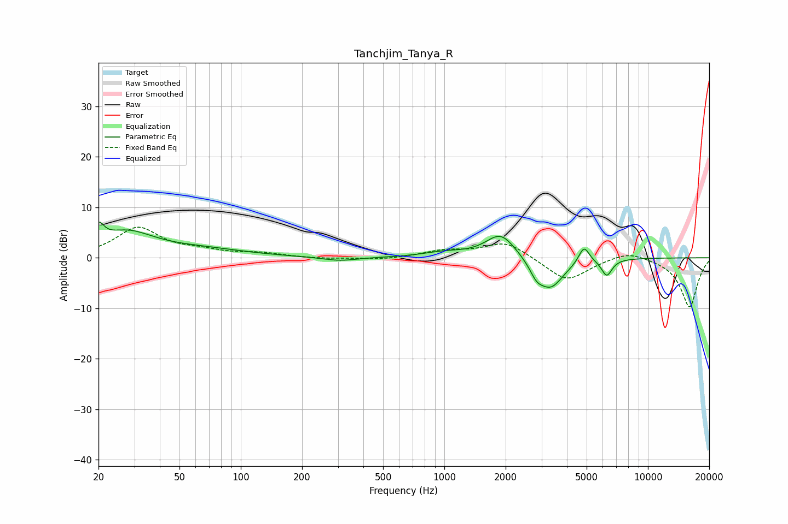

# Tanchjim_Tanya_R
See [usage instructions](https://github.com/jaakkopasanen/AutoEq#usage) for more options and info.

### Parametric EQs
Apply preamp of -7.1 dB when using parametric equalizer.

|   # | Type    |   Fc (Hz) |    Q |   Gain (dB) |
|-----|---------|-----------|------|-------------|
|   1 | Peaking |        20 | 5.46 |         3.5 |
|   2 | Peaking |        27 | 1.04 |         4.7 |
|   3 | Peaking |        65 | 0.65 |         1.4 |
|   4 | Peaking |       306 | 1.67 |        -0.8 |
|   5 | Peaking |       999 | 1.39 |         0.9 |
|   6 | Peaking |      1894 | 1.91 |         5   |
|   7 | Peaking |      2834 | 4.38 |        -2.1 |
|   8 | Peaking |      3320 | 2.12 |        -6.1 |
|   9 | Peaking |      4852 | 5.35 |         3.4 |
|  10 | Peaking |      6276 | 5.28 |        -3.3 |

### Fixed Band EQs
When using fixed band (also called graphic) equalizer, apply preamp of **-6.2 dB** (if available) and set gains manually with these parameters.

|   # | Type    |   Fc (Hz) |    Q |   Gain (dB) |
|-----|---------|-----------|------|-------------|
|   1 | Peaking |        31 | 1.41 |         5.8 |
|   2 | Peaking |        62 | 1.41 |         1   |
|   3 | Peaking |       125 | 1.41 |         0.8 |
|   4 | Peaking |       250 | 1.41 |        -0.2 |
|   5 | Peaking |       500 | 1.41 |        -0.4 |
|   6 | Peaking |      1000 | 1.41 |         1.3 |
|   7 | Peaking |      2000 | 1.41 |         3.3 |
|   8 | Peaking |      4000 | 1.41 |        -4.7 |
|   9 | Peaking |      8000 | 1.41 |         1.6 |
|  10 | Peaking |     16000 | 1.41 |        -9.8 |

### Graphs

