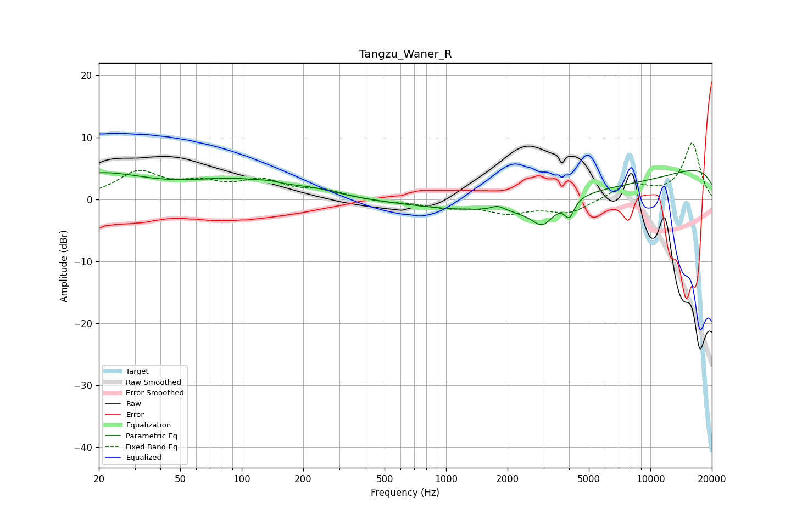

# Tangzu_Waner_R
See [usage instructions](https://github.com/jaakkopasanen/AutoEq#usage) for more options and info.

### Parametric EQs
Apply preamp of -4.7 dB when using parametric equalizer.

|   # | Type    |   Fc (Hz) |    Q |   Gain (dB) |
|-----|---------|-----------|------|-------------|
|   1 | Peaking |        20 | 0.62 |         3.9 |
|   2 | Peaking |        95 | 0.6  |         2.8 |
|   3 | Peaking |       137 | 3.65 |         0.2 |
|   4 | Peaking |       227 | 1.18 |         0.8 |
|   5 | Peaking |      1788 | 4.67 |         0.7 |
|   6 | Peaking |      2317 | 2.33 |        -0.5 |
|   7 | Peaking |      2966 | 2.59 |        -3.7 |
|   8 | Peaking |      4012 | 6    |        -2.7 |
|   9 | Peaking |      4718 | 0.21 |        -6.2 |
|  10 | Peaking |      9616 | 0.18 |         8.4 |

### Fixed Band EQs
When using fixed band (also called graphic) equalizer, apply preamp of **-9.2 dB** (if available) and set gains manually with these parameters.

|   # | Type    |   Fc (Hz) |    Q |   Gain (dB) |
|-----|---------|-----------|------|-------------|
|   1 | Peaking |        31 | 1.41 |         4.2 |
|   2 | Peaking |        62 | 1.41 |         2.1 |
|   3 | Peaking |       125 | 1.41 |         2.7 |
|   4 | Peaking |       250 | 1.41 |         1.2 |
|   5 | Peaking |       500 | 1.41 |        -0.4 |
|   6 | Peaking |      1000 | 1.41 |        -1.1 |
|   7 | Peaking |      2000 | 1.41 |        -2   |
|   8 | Peaking |      4000 | 1.41 |        -2.2 |
|   9 | Peaking |      8000 | 1.41 |         2.4 |
|  10 | Peaking |     16000 | 1.41 |         9   |

### Graphs

