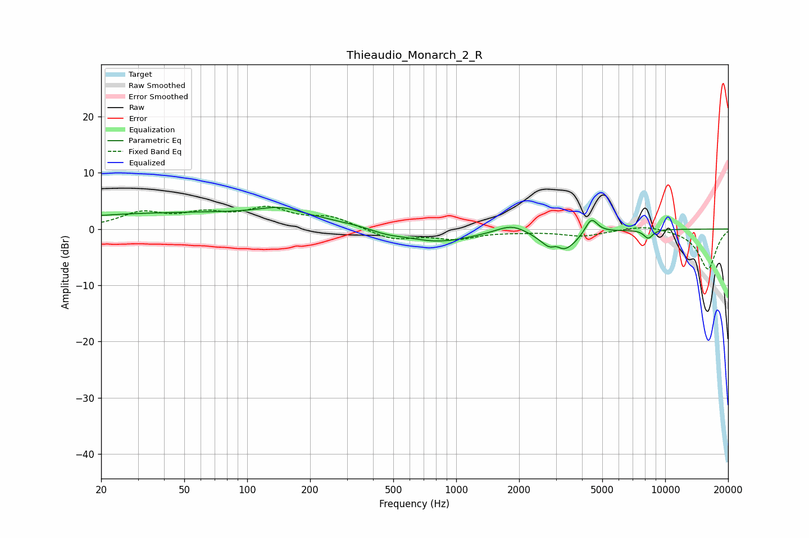

# Thieaudio_Monarch_2_R
See [usage instructions](https://github.com/jaakkopasanen/AutoEq#usage) for more options and info.

### Parametric EQs
Apply preamp of -3.9 dB when using parametric equalizer.

|   # | Type    |   Fc (Hz) |    Q |   Gain (dB) |
|-----|---------|-----------|------|-------------|
|   1 | Peaking |        56 | 0.18 |         2.9 |
|   2 | Peaking |       144 | 1.42 |         1.4 |
|   3 | Peaking |       459 | 1.75 |        -0.7 |
|   4 | Peaking |       809 | 0.84 |        -2.4 |
|   5 | Peaking |      1845 | 1.98 |         1.6 |
|   6 | Peaking |      2892 | 3.18 |        -2   |
|   7 | Peaking |      3007 | 5.11 |         1.8 |
|   8 | Peaking |      3225 | 1.99 |        -3.6 |
|   9 | Peaking |      4428 | 4.73 |         2.9 |
|  10 | Peaking |      8296 | 6    |        -1.5 |

### Fixed Band EQs
When using fixed band (also called graphic) equalizer, apply preamp of **-4.1 dB** (if available) and set gains manually with these parameters.

|   # | Type    |   Fc (Hz) |    Q |   Gain (dB) |
|-----|---------|-----------|------|-------------|
|   1 | Peaking |        31 | 1.41 |         2.7 |
|   2 | Peaking |        62 | 1.41 |         2.2 |
|   3 | Peaking |       125 | 1.41 |         3.2 |
|   4 | Peaking |       250 | 1.41 |         1.9 |
|   5 | Peaking |       500 | 1.41 |        -1.9 |
|   6 | Peaking |      1000 | 1.41 |        -1.6 |
|   7 | Peaking |      2000 | 1.41 |        -0.3 |
|   8 | Peaking |      4000 | 1.41 |        -1.2 |
|   9 | Peaking |      8000 | 1.41 |         0.8 |
|  10 | Peaking |     16000 | 1.41 |        -7.2 |

### Graphs

