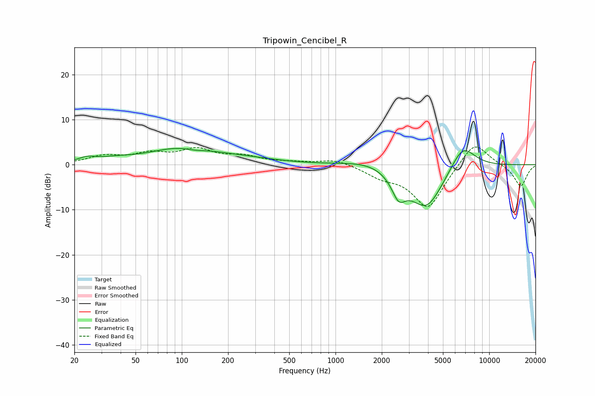

# Tripowin_Cencibel_R
See [usage instructions](https://github.com/jaakkopasanen/AutoEq#usage) for more options and info.

### Parametric EQs
Apply preamp of -3.7 dB when using parametric equalizer.

|   # | Type    |   Fc (Hz) |    Q |   Gain (dB) |
|-----|---------|-----------|------|-------------|
|   1 | Peaking |        24 | 2.54 |         1   |
|   2 | Peaking |        37 | 1.19 |         0.8 |
|   3 | Peaking |       103 | 0.66 |         3.7 |
|   4 | Peaking |       121 | 1.88 |        -0.7 |
|   5 | Peaking |       273 | 0.67 |         0.8 |
|   6 | Peaking |      1716 | 0.87 |         1.6 |
|   7 | Peaking |      2575 | 3.16 |        -4.6 |
|   8 | Peaking |      3869 | 1.08 |        -9.1 |
|   9 | Peaking |      3983 | 2.09 |        -1.1 |
|  10 | Peaking |      6687 | 1.6  |         6.3 |

### Fixed Band EQs
When using fixed band (also called graphic) equalizer, apply preamp of **-4.0 dB** (if available) and set gains manually with these parameters.

|   # | Type    |   Fc (Hz) |    Q |   Gain (dB) |
|-----|---------|-----------|------|-------------|
|   1 | Peaking |        31 | 1.41 |         1.7 |
|   2 | Peaking |        62 | 1.41 |         2.1 |
|   3 | Peaking |       125 | 1.41 |         3.1 |
|   4 | Peaking |       250 | 1.41 |         1.6 |
|   5 | Peaking |       500 | 1.41 |         0.4 |
|   6 | Peaking |      1000 | 1.41 |         1.3 |
|   7 | Peaking |      2000 | 1.41 |        -2.1 |
|   8 | Peaking |      4000 | 1.41 |        -9.7 |
|   9 | Peaking |      8000 | 1.41 |         5.7 |
|  10 | Peaking |     16000 | 1.41 |        -4.9 |

### Graphs

