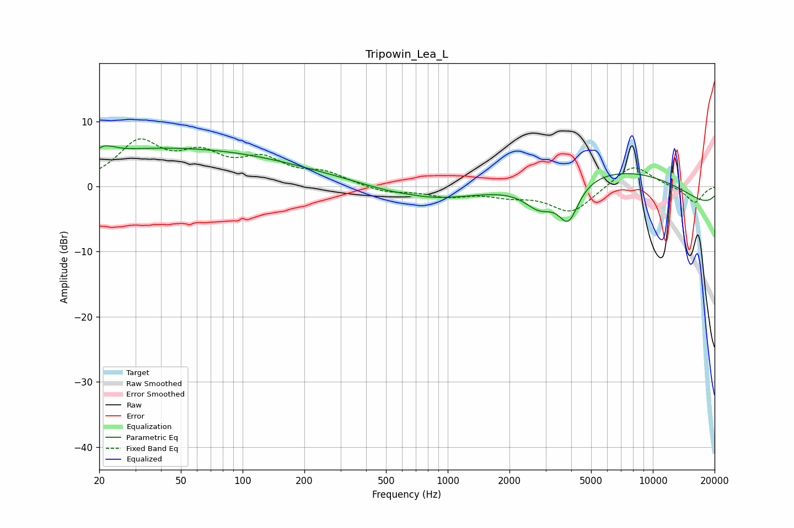

# Tripowin_Lea_L
See [usage instructions](https://github.com/jaakkopasanen/AutoEq#usage) for more options and info.

### Parametric EQs
Apply preamp of -6.3 dB when using parametric equalizer.

|   # | Type    |   Fc (Hz) |    Q |   Gain (dB) |
|-----|---------|-----------|------|-------------|
|   1 | Peaking |        22 | 5.11 |         3.6 |
|   2 | Peaking |        22 | 5.97 |        -2.7 |
|   3 | Peaking |        38 | 0.25 |         5.6 |
|   4 | Peaking |       325 | 0.3  |         1.6 |
|   5 | Peaking |       655 | 2.8  |         0.1 |
|   6 | Peaking |       765 | 0.5  |        -3.2 |
|   7 | Peaking |      2806 | 1.83 |        -3.6 |
|   8 | Peaking |      3878 | 2.81 |        -5.9 |
|   9 | Peaking |      6828 | 0.31 |         8.2 |
|  10 | Peaking |     10000 | 0.18 |        -5.8 |

### Fixed Band EQs
When using fixed band (also called graphic) equalizer, apply preamp of **-7.4 dB** (if available) and set gains manually with these parameters.

|   # | Type    |   Fc (Hz) |    Q |   Gain (dB) |
|-----|---------|-----------|------|-------------|
|   1 | Peaking |        31 | 1.41 |         6.4 |
|   2 | Peaking |        62 | 1.41 |         4.1 |
|   3 | Peaking |       125 | 1.41 |         3.6 |
|   4 | Peaking |       250 | 1.41 |         1.8 |
|   5 | Peaking |       500 | 1.41 |        -0.9 |
|   6 | Peaking |      1000 | 1.41 |        -1.3 |
|   7 | Peaking |      2000 | 1.41 |        -1.1 |
|   8 | Peaking |      4000 | 1.41 |        -4   |
|   9 | Peaking |      8000 | 1.41 |         3.6 |
|  10 | Peaking |     16000 | 1.41 |        -2.6 |

### Graphs

