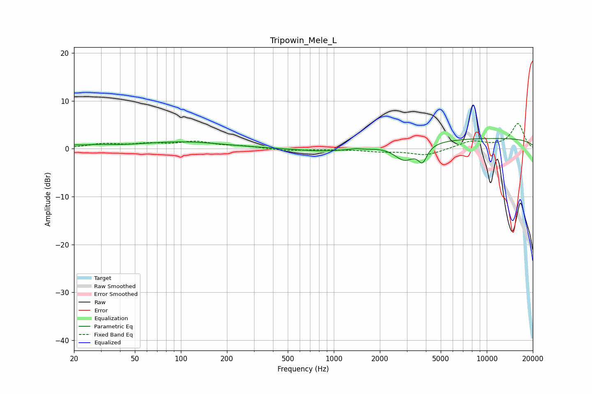

# Tripowin_Mele_L
See [usage instructions](https://github.com/jaakkopasanen/AutoEq#usage) for more options and info.

### Parametric EQs
Apply preamp of -2.2 dB when using parametric equalizer.

|   # | Type    |   Fc (Hz) |    Q |   Gain (dB) |
|-----|---------|-----------|------|-------------|
|   1 | Peaking |        20 | 3.69 |         0.3 |
|   2 | Peaking |        28 | 1.24 |         0.5 |
|   3 | Peaking |        85 | 0.6  |         0.4 |
|   4 | Peaking |       111 | 0.51 |         1   |
|   5 | Peaking |       865 | 0.85 |        -0.7 |
|   6 | Peaking |      1403 | 3.65 |         0.3 |
|   7 | Peaking |      1530 | 2.17 |        -0.3 |
|   8 | Peaking |      2897 | 2.12 |        -3.4 |
|   9 | Peaking |      3805 | 4.7  |        -3.2 |
|  10 | Peaking |     10000 | 0.18 |         2.2 |

### Fixed Band EQs
When using fixed band (also called graphic) equalizer, apply preamp of **-5.3 dB** (if available) and set gains manually with these parameters.

|   # | Type    |   Fc (Hz) |    Q |   Gain (dB) |
|-----|---------|-----------|------|-------------|
|   1 | Peaking |        31 | 1.41 |         0.9 |
|   2 | Peaking |        62 | 1.41 |         0.8 |
|   3 | Peaking |       125 | 1.41 |         1.3 |
|   4 | Peaking |       250 | 1.41 |         0.5 |
|   5 | Peaking |       500 | 1.41 |        -0.4 |
|   6 | Peaking |      1000 | 1.41 |        -0.1 |
|   7 | Peaking |      2000 | 1.41 |        -0.5 |
|   8 | Peaking |      4000 | 1.41 |        -1.4 |
|   9 | Peaking |      8000 | 1.41 |         1.6 |
|  10 | Peaking |     16000 | 1.41 |         5.2 |

### Graphs

