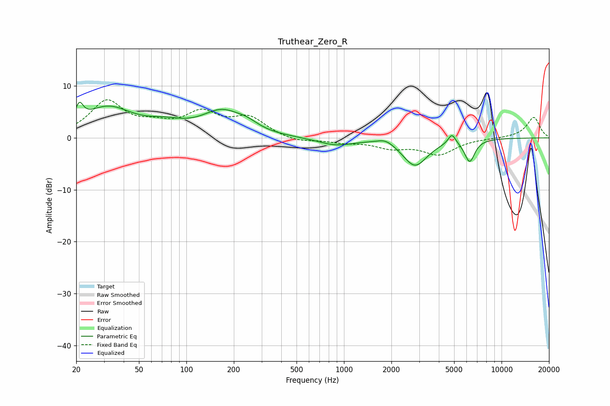

# Truthear_Zero_R
See [usage instructions](https://github.com/jaakkopasanen/AutoEq#usage) for more options and info.

### Parametric EQs
Apply preamp of -7.0 dB when using parametric equalizer.

|   # | Type    |   Fc (Hz) |    Q |   Gain (dB) |
|-----|---------|-----------|------|-------------|
|   1 | Peaking |        21 | 5.82 |         3.2 |
|   2 | Peaking |        32 | 0.9  |         5.6 |
|   3 | Peaking |        73 | 1.19 |         1.6 |
|   4 | Peaking |       168 | 1.09 |         4.6 |
|   5 | Peaking |       243 | 2.01 |         1.1 |
|   6 | Peaking |       884 | 1.27 |        -1.4 |
|   7 | Peaking |      1845 | 2.59 |         1   |
|   8 | Peaking |      2824 | 1.79 |        -5.3 |
|   9 | Peaking |      4843 | 5.78 |         2   |
|  10 | Peaking |      6277 | 4.27 |        -4.3 |

### Fixed Band EQs
When using fixed band (also called graphic) equalizer, apply preamp of **-7.4 dB** (if available) and set gains manually with these parameters.

|   # | Type    |   Fc (Hz) |    Q |   Gain (dB) |
|-----|---------|-----------|------|-------------|
|   1 | Peaking |        31 | 1.41 |         6.8 |
|   2 | Peaking |        62 | 1.41 |         1.8 |
|   3 | Peaking |       125 | 1.41 |         4.3 |
|   4 | Peaking |       250 | 1.41 |         3.6 |
|   5 | Peaking |       500 | 1.41 |        -0.9 |
|   6 | Peaking |      1000 | 1.41 |        -0.7 |
|   7 | Peaking |      2000 | 1.41 |        -1.7 |
|   8 | Peaking |      4000 | 1.41 |        -3   |
|   9 | Peaking |      8000 | 1.41 |        -0   |
|  10 | Peaking |     16000 | 1.41 |         4   |

### Graphs

