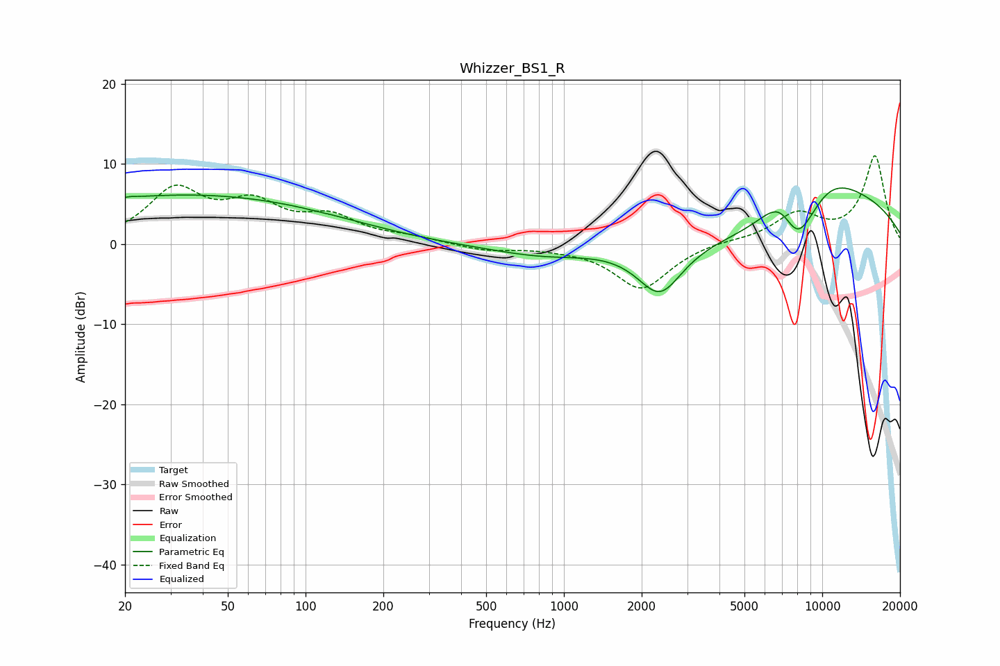

# Whizzer_BS1_R
See [usage instructions](https://github.com/jaakkopasanen/AutoEq#usage) for more options and info.

### Parametric EQs
Apply preamp of -7.1 dB when using parametric equalizer.

|   # | Type    |   Fc (Hz) |    Q |   Gain (dB) |
|-----|---------|-----------|------|-------------|
|   1 | Peaking |        21 | 5.95 |         0.2 |
|   2 | Peaking |        21 | 2.78 |         0   |
|   3 | Peaking |        38 | 0.23 |         7.3 |
|   4 | Peaking |        66 | 0.18 |        -1.2 |
|   5 | Peaking |       110 | 5.55 |        -0   |
|   6 | Peaking |       836 | 0.71 |        -1.4 |
|   7 | Peaking |      2352 | 1.59 |        -6.4 |
|   8 | Peaking |      7035 | 1.4  |         8.7 |
|   9 | Peaking |      7907 | 0.84 |       -20   |
|  10 | Peaking |     10000 | 0.45 |        16.7 |

### Fixed Band EQs
When using fixed band (also called graphic) equalizer, apply preamp of **-11.1 dB** (if available) and set gains manually with these parameters.

|   # | Type    |   Fc (Hz) |    Q |   Gain (dB) |
|-----|---------|-----------|------|-------------|
|   1 | Peaking |        31 | 1.41 |         6.4 |
|   2 | Peaking |        62 | 1.41 |         4.3 |
|   3 | Peaking |       125 | 1.41 |         2.9 |
|   4 | Peaking |       250 | 1.41 |         0.7 |
|   5 | Peaking |       500 | 1.41 |        -0.8 |
|   6 | Peaking |      1000 | 1.41 |        -0.3 |
|   7 | Peaking |      2000 | 1.41 |        -5.6 |
|   8 | Peaking |      4000 | 1.41 |         0.4 |
|   9 | Peaking |      8000 | 1.41 |         3.5 |
|  10 | Peaking |     16000 | 1.41 |        10.9 |

### Graphs

