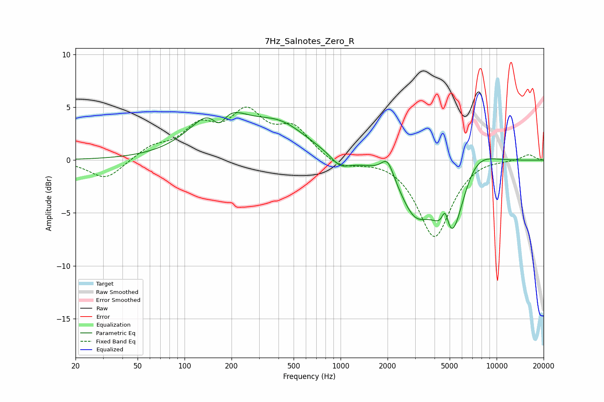

# 7Hz_Salnotes_Zero_R
See [usage instructions](https://github.com/jaakkopasanen/AutoEq#usage) for more options and info.

### Parametric EQs
Apply preamp of -4.6 dB when using parametric equalizer.

|   # | Type    |   Fc (Hz) |    Q |   Gain (dB) |
|-----|---------|-----------|------|-------------|
|   1 | Peaking |       164 | 0.95 |         5.1 |
|   2 | Peaking |       167 | 2.81 |        -2.3 |
|   3 | Peaking |       410 | 0.79 |         2.9 |
|   4 | Peaking |       994 | 2.4  |        -1.1 |
|   5 | Peaking |      1263 | 2.37 |        -0.1 |
|   6 | Peaking |      2001 | 3.51 |         1.8 |
|   7 | Peaking |      2991 | 1.41 |        -4.2 |
|   8 | Peaking |      4685 | 6    |         2.4 |
|   9 | Peaking |      5078 | 1.58 |        -7.8 |
|  10 | Peaking |      7110 | 1.13 |         2.3 |

### Fixed Band EQs
When using fixed band (also called graphic) equalizer, apply preamp of **-5.1 dB** (if available) and set gains manually with these parameters.

|   # | Type    |   Fc (Hz) |    Q |   Gain (dB) |
|-----|---------|-----------|------|-------------|
|   1 | Peaking |        31 | 1.41 |        -1.9 |
|   2 | Peaking |        62 | 1.41 |         1.1 |
|   3 | Peaking |       125 | 1.41 |         2.8 |
|   4 | Peaking |       250 | 1.41 |         4   |
|   5 | Peaking |       500 | 1.41 |         2.8 |
|   6 | Peaking |      1000 | 1.41 |        -0.8 |
|   7 | Peaking |      2000 | 1.41 |         0.2 |
|   8 | Peaking |      4000 | 1.41 |        -7.3 |
|   9 | Peaking |      8000 | 1.41 |         0.3 |
|  10 | Peaking |     16000 | 1.41 |         0.6 |

### Graphs

