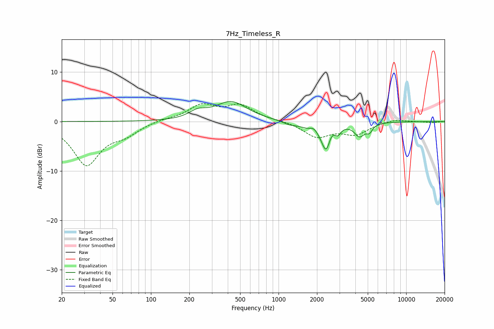

# 7Hz_Timeless_R
See [usage instructions](https://github.com/jaakkopasanen/AutoEq#usage) for more options and info.

### Parametric EQs
Apply preamp of -4.1 dB when using parametric equalizer.

|   # | Type    |   Fc (Hz) |    Q |   Gain (dB) |
|-----|---------|-----------|------|-------------|
|   1 | Peaking |       232 | 2.14 |         1.4 |
|   2 | Peaking |       425 | 1.12 |         3.9 |
|   3 | Peaking |      1215 | 3.02 |        -0.5 |
|   4 | Peaking |      1806 | 1.68 |        -1.3 |
|   5 | Peaking |      1884 | 4.61 |         1   |
|   6 | Peaking |      2369 | 3.83 |        -5.9 |
|   7 | Peaking |      2561 | 4.34 |         1.7 |
|   8 | Peaking |      2912 | 6    |        -1.5 |
|   9 | Peaking |      4316 | 3.45 |        -2.6 |
|  10 | Peaking |      5157 | 6    |        -1.3 |

### Fixed Band EQs
When using fixed band (also called graphic) equalizer, apply preamp of **-3.7 dB** (if available) and set gains manually with these parameters.

|   # | Type    |   Fc (Hz) |    Q |   Gain (dB) |
|-----|---------|-----------|------|-------------|
|   1 | Peaking |        31 | 1.41 |        -8.6 |
|   2 | Peaking |        62 | 1.41 |        -2.1 |
|   3 | Peaking |       125 | 1.41 |         0.4 |
|   4 | Peaking |       250 | 1.41 |         3.1 |
|   5 | Peaking |       500 | 1.41 |         3   |
|   6 | Peaking |      1000 | 1.41 |         0.2 |
|   7 | Peaking |      2000 | 1.41 |        -3   |
|   8 | Peaking |      4000 | 1.41 |        -2.4 |
|   9 | Peaking |      8000 | 1.41 |         0.6 |
|  10 | Peaking |     16000 | 1.41 |        -0.2 |

### Graphs

