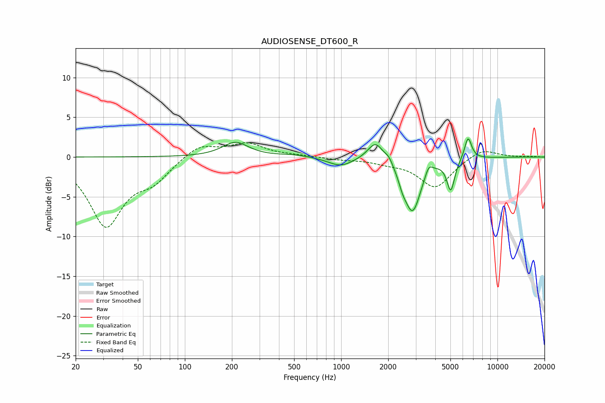

# AUDIOSENSE_DT600_R
See [usage instructions](https://github.com/jaakkopasanen/AutoEq#usage) for more options and info.

### Parametric EQs
Apply preamp of -2.4 dB when using parametric equalizer.

|   # | Type    |   Fc (Hz) |    Q |   Gain (dB) |
|-----|---------|-----------|------|-------------|
|   1 | Peaking |       211 | 1.71 |         1.8 |
|   2 | Peaking |       498 | 1.48 |         0.3 |
|   3 | Peaking |       992 | 1.8  |        -1.1 |
|   4 | Peaking |      1662 | 2.82 |         2.4 |
|   5 | Peaking |      2023 | 5.9  |         0.7 |
|   6 | Peaking |      2466 | 6    |        -0.9 |
|   7 | Peaking |      2857 | 2.61 |        -6.8 |
|   8 | Peaking |      3633 | 6    |         1.3 |
|   9 | Peaking |      5026 | 5.71 |        -3.9 |
|  10 | Peaking |      6486 | 6    |         2.8 |

### Fixed Band EQs
When using fixed band (also called graphic) equalizer, apply preamp of **-1.9 dB** (if available) and set gains manually with these parameters.

|   # | Type    |   Fc (Hz) |    Q |   Gain (dB) |
|-----|---------|-----------|------|-------------|
|   1 | Peaking |        31 | 1.41 |        -8.5 |
|   2 | Peaking |        62 | 1.41 |        -2.4 |
|   3 | Peaking |       125 | 1.41 |         1.7 |
|   4 | Peaking |       250 | 1.41 |         1.6 |
|   5 | Peaking |       500 | 1.41 |         0.2 |
|   6 | Peaking |      1000 | 1.41 |        -0.3 |
|   7 | Peaking |      2000 | 1.41 |        -0.5 |
|   8 | Peaking |      4000 | 1.41 |        -3.8 |
|   9 | Peaking |      8000 | 1.41 |         1.2 |
|  10 | Peaking |     16000 | 1.41 |         0.1 |

### Graphs

