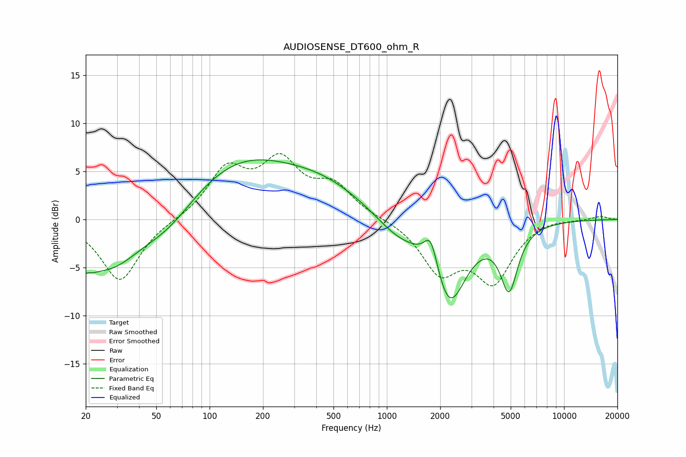

# AUDIOSENSE_DT600_ohm_R
See [usage instructions](https://github.com/jaakkopasanen/AutoEq#usage) for more options and info.

### Parametric EQs
Apply preamp of -6.3 dB when using parametric equalizer.

|   # | Type    |   Fc (Hz) |    Q |   Gain (dB) |
|-----|---------|-----------|------|-------------|
|   1 | Peaking |        20 | 4.55 |        -4.6 |
|   2 | Peaking |        20 | 5.56 |         3.3 |
|   3 | Peaking |        27 | 0.75 |        -5.3 |
|   4 | Peaking |        59 | 0.95 |        -2.1 |
|   5 | Peaking |       147 | 0.45 |         5.8 |
|   6 | Peaking |       450 | 0.57 |         2.7 |
|   7 | Peaking |      1143 | 1.1  |        -1.9 |
|   8 | Peaking |      1773 | 3.72 |         3.4 |
|   9 | Peaking |      2257 | 1.48 |        -8.5 |
|  10 | Peaking |      4896 | 2.86 |        -6.4 |

### Fixed Band EQs
When using fixed band (also called graphic) equalizer, apply preamp of **-7.0 dB** (if available) and set gains manually with these parameters.

|   # | Type    |   Fc (Hz) |    Q |   Gain (dB) |
|-----|---------|-----------|------|-------------|
|   1 | Peaking |        31 | 1.41 |        -6.4 |
|   2 | Peaking |        62 | 1.41 |        -0   |
|   3 | Peaking |       125 | 1.41 |         4.9 |
|   4 | Peaking |       250 | 1.41 |         5.5 |
|   5 | Peaking |       500 | 1.41 |         3.2 |
|   6 | Peaking |      1000 | 1.41 |         0.1 |
|   7 | Peaking |      2000 | 1.41 |        -5.1 |
|   8 | Peaking |      4000 | 1.41 |        -6.1 |
|   9 | Peaking |      8000 | 1.41 |         0.3 |
|  10 | Peaking |     16000 | 1.41 |         0.4 |

### Graphs

