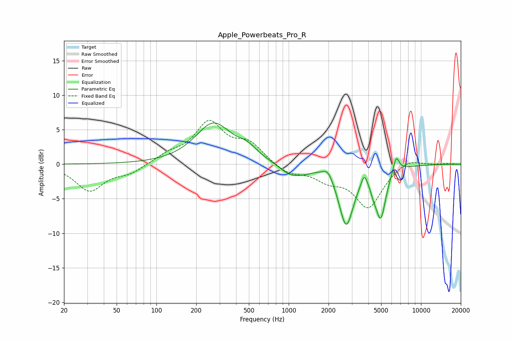

# Apple_Powerbeats_Pro_R
See [usage instructions](https://github.com/jaakkopasanen/AutoEq#usage) for more options and info.

### Parametric EQs
Apply preamp of -6.1 dB when using parametric equalizer.

|   # | Type    |   Fc (Hz) |    Q |   Gain (dB) |
|-----|---------|-----------|------|-------------|
|   1 | Peaking |       270 | 1.04 |         5.8 |
|   2 | Peaking |       488 | 1.85 |         1.4 |
|   3 | Peaking |      1049 | 1.64 |        -1.7 |
|   4 | Peaking |      1355 | 3.35 |        -0.3 |
|   5 | Peaking |      1979 | 3.77 |         1.4 |
|   6 | Peaking |      2720 | 2.52 |        -8.6 |
|   7 | Peaking |      3726 | 6    |         1.9 |
|   8 | Peaking |      4385 | 5.71 |        -1   |
|   9 | Peaking |      4963 | 3.58 |        -7   |
|  10 | Peaking |      6496 | 5.96 |         2.4 |

### Fixed Band EQs
When using fixed band (also called graphic) equalizer, apply preamp of **-6.5 dB** (if available) and set gains manually with these parameters.

|   # | Type    |   Fc (Hz) |    Q |   Gain (dB) |
|-----|---------|-----------|------|-------------|
|   1 | Peaking |        31 | 1.41 |        -3.8 |
|   2 | Peaking |        62 | 1.41 |        -1.2 |
|   3 | Peaking |       125 | 1.41 |         1.2 |
|   4 | Peaking |       250 | 1.41 |         5.8 |
|   5 | Peaking |       500 | 1.41 |         2.7 |
|   6 | Peaking |      1000 | 1.41 |        -1.4 |
|   7 | Peaking |      2000 | 1.41 |        -1.9 |
|   8 | Peaking |      4000 | 1.41 |        -6.1 |
|   9 | Peaking |      8000 | 1.41 |         1   |
|  10 | Peaking |     16000 | 1.41 |         0.1 |

### Graphs

