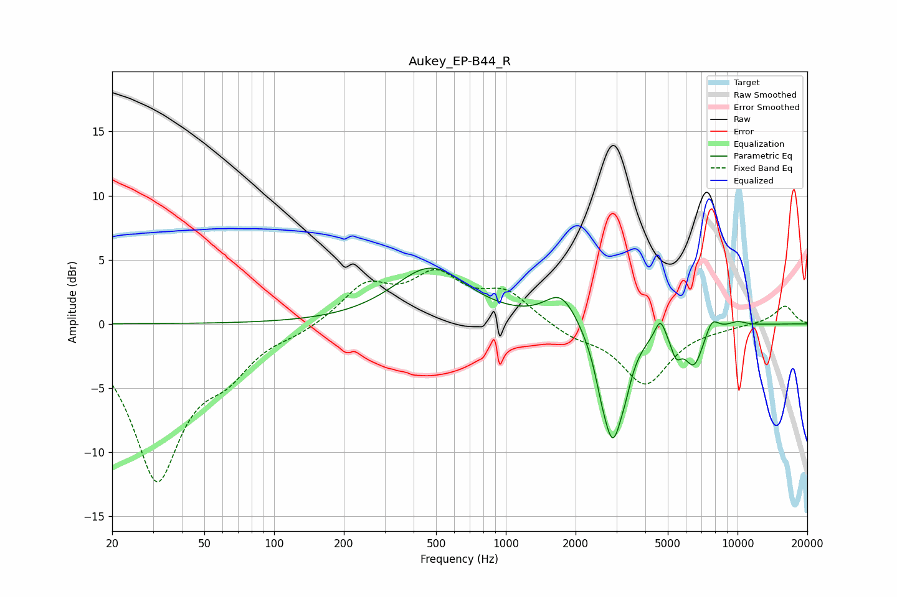

# Aukey_EP-B44_R
See [usage instructions](https://github.com/jaakkopasanen/AutoEq#usage) for more options and info.

### Parametric EQs
Apply preamp of -4.4 dB when using parametric equalizer.

|   # | Type    |   Fc (Hz) |    Q |   Gain (dB) |
|-----|---------|-----------|------|-------------|
|   1 | Peaking |       474 | 0.9  |         4.3 |
|   2 | Peaking |      1739 | 1.99 |         2.5 |
|   3 | Peaking |      2581 | 4.99 |        -1.1 |
|   4 | Peaking |      2898 | 2.91 |        -8.7 |
|   5 | Peaking |      3292 | 6    |        -0.9 |
|   6 | Peaking |      4642 | 6    |         1.6 |
|   7 | Peaking |      5430 | 5.99 |        -1.6 |
|   8 | Peaking |      6489 | 3.29 |        -3   |
|   9 | Peaking |      7752 | 4.69 |         1.2 |
|  10 | Peaking |     10000 | 3.37 |         0.3 |

### Fixed Band EQs
When using fixed band (also called graphic) equalizer, apply preamp of **-4.3 dB** (if available) and set gains manually with these parameters.

|   # | Type    |   Fc (Hz) |    Q |   Gain (dB) |
|-----|---------|-----------|------|-------------|
|   1 | Peaking |        31 | 1.41 |       -11.8 |
|   2 | Peaking |        62 | 1.41 |        -2.7 |
|   3 | Peaking |       125 | 1.41 |        -0.5 |
|   4 | Peaking |       250 | 1.41 |         2.9 |
|   5 | Peaking |       500 | 1.41 |         3.4 |
|   6 | Peaking |      1000 | 1.41 |         2.3 |
|   7 | Peaking |      2000 | 1.41 |        -0.9 |
|   8 | Peaking |      4000 | 1.41 |        -4.6 |
|   9 | Peaking |      8000 | 1.41 |        -0.2 |
|  10 | Peaking |     16000 | 1.41 |         1.4 |

### Graphs

