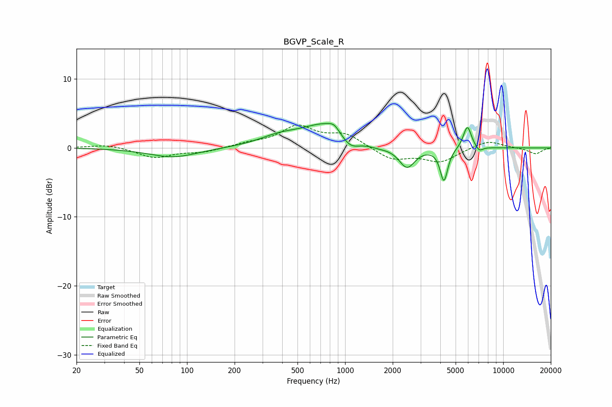

# BGVP_Scale_R
See [usage instructions](https://github.com/jaakkopasanen/AutoEq#usage) for more options and info.

### Parametric EQs
Apply preamp of -3.6 dB when using parametric equalizer.

|   # | Type    |   Fc (Hz) |    Q |   Gain (dB) |
|-----|---------|-----------|------|-------------|
|   1 | Peaking |        82 | 0.93 |        -1.4 |
|   2 | Peaking |       385 | 1.09 |         1.2 |
|   3 | Peaking |       786 | 0.92 |         3.6 |
|   4 | Peaking |       852 | 4.34 |         0.8 |
|   5 | Peaking |      1070 | 2.17 |        -2.2 |
|   6 | Peaking |      1619 | 2.1  |        -0.4 |
|   7 | Peaking |      2463 | 2.81 |        -3   |
|   8 | Peaking |      4219 | 5.85 |        -4.8 |
|   9 | Peaking |      5932 | 5.37 |         3.3 |
|  10 | Peaking |      7057 | 6    |        -0.7 |

### Fixed Band EQs
When using fixed band (also called graphic) equalizer, apply preamp of **-3.4 dB** (if available) and set gains manually with these parameters.

|   # | Type    |   Fc (Hz) |    Q |   Gain (dB) |
|-----|---------|-----------|------|-------------|
|   1 | Peaking |        31 | 1.41 |         0.5 |
|   2 | Peaking |        62 | 1.41 |        -1.4 |
|   3 | Peaking |       125 | 1.41 |        -0.6 |
|   4 | Peaking |       250 | 1.41 |         0.5 |
|   5 | Peaking |       500 | 1.41 |         3   |
|   6 | Peaking |      1000 | 1.41 |         1.9 |
|   7 | Peaking |      2000 | 1.41 |        -1.7 |
|   8 | Peaking |      4000 | 1.41 |        -2   |
|   9 | Peaking |      8000 | 1.41 |         1.1 |
|  10 | Peaking |     16000 | 1.41 |        -0.9 |

### Graphs

