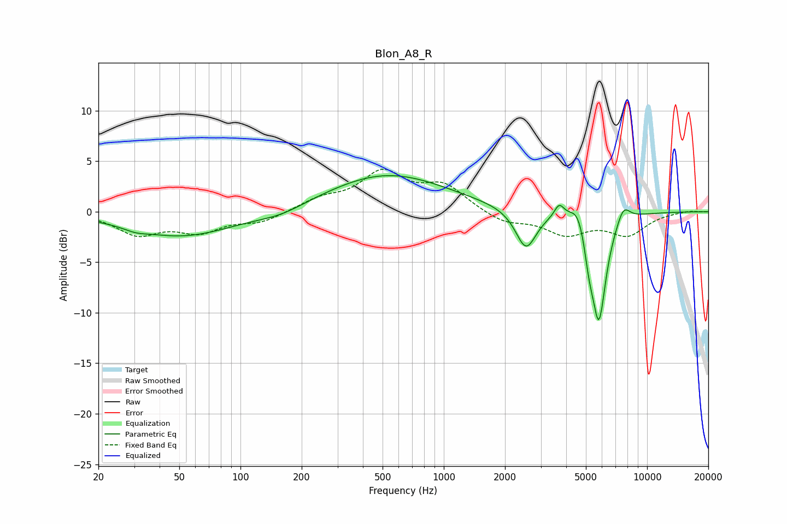

# Blon_A8_R
See [usage instructions](https://github.com/jaakkopasanen/AutoEq#usage) for more options and info.

### Parametric EQs
Apply preamp of -3.7 dB when using parametric equalizer.

|   # | Type    |   Fc (Hz) |    Q |   Gain (dB) |
|-----|---------|-----------|------|-------------|
|   1 | Peaking |        30 | 2.65 |        -0.3 |
|   2 | Peaking |        51 | 0.55 |        -2.4 |
|   3 | Peaking |       159 | 1.15 |        -0.7 |
|   4 | Peaking |       526 | 0.47 |         3.7 |
|   5 | Peaking |      2537 | 2.78 |        -3.9 |
|   6 | Peaking |      3695 | 5.99 |         1.3 |
|   7 | Peaking |      4590 | 3.32 |         2.1 |
|   8 | Peaking |      5178 | 6    |        -2.4 |
|   9 | Peaking |      5791 | 3.77 |       -10.7 |
|  10 | Peaking |      7645 | 4.1  |         1.7 |

### Fixed Band EQs
When using fixed band (also called graphic) equalizer, apply preamp of **-4.3 dB** (if available) and set gains manually with these parameters.

|   # | Type    |   Fc (Hz) |    Q |   Gain (dB) |
|-----|---------|-----------|------|-------------|
|   1 | Peaking |        31 | 1.41 |        -2.1 |
|   2 | Peaking |        62 | 1.41 |        -1.8 |
|   3 | Peaking |       125 | 1.41 |        -1   |
|   4 | Peaking |       250 | 1.41 |         1.1 |
|   5 | Peaking |       500 | 1.41 |         3.7 |
|   6 | Peaking |      1000 | 1.41 |         2.4 |
|   7 | Peaking |      2000 | 1.41 |        -1.1 |
|   8 | Peaking |      4000 | 1.41 |        -2.1 |
|   9 | Peaking |      8000 | 1.41 |        -2.2 |
|  10 | Peaking |     16000 | 1.41 |         0.1 |

### Graphs

