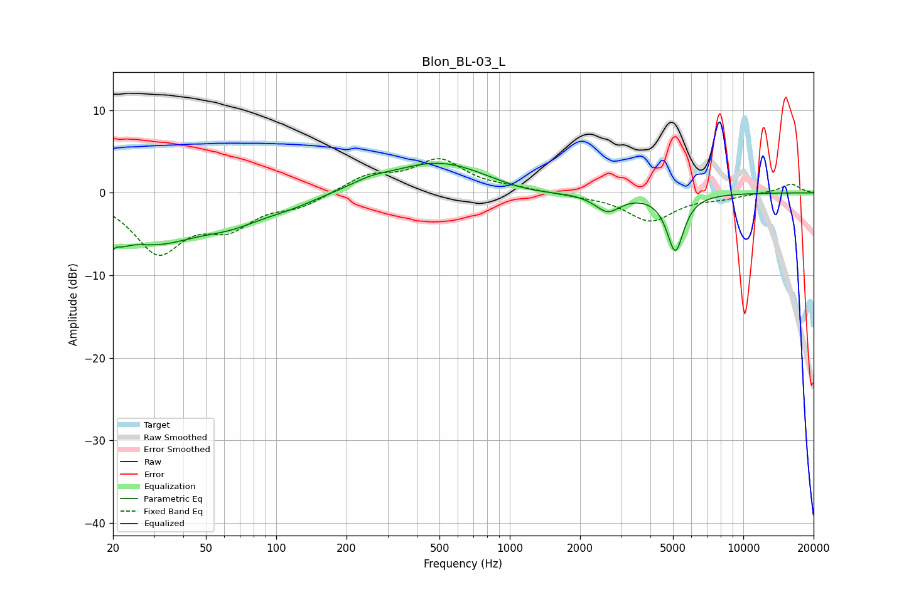

# Blon_BL-03_L
See [usage instructions](https://github.com/jaakkopasanen/AutoEq#usage) for more options and info.

### Parametric EQs
Apply preamp of -3.7 dB when using parametric equalizer.

|   # | Type    |   Fc (Hz) |    Q |   Gain (dB) |
|-----|---------|-----------|------|-------------|
|   1 | Peaking |        20 | 3.99 |        -5.7 |
|   2 | Peaking |        20 | 5.93 |         3.1 |
|   3 | Peaking |        30 | 0.73 |        -5.3 |
|   4 | Peaking |        64 | 0.98 |        -2.1 |
|   5 | Peaking |       114 | 1.08 |        -1   |
|   6 | Peaking |       253 | 1.75 |         0.6 |
|   7 | Peaking |       502 | 0.66 |         3.8 |
|   8 | Peaking |      1165 | 0.89 |        -0.8 |
|   9 | Peaking |      2625 | 2.57 |        -2.2 |
|  10 | Peaking |      5115 | 3.85 |        -6.9 |

### Fixed Band EQs
When using fixed band (also called graphic) equalizer, apply preamp of **-4.2 dB** (if available) and set gains manually with these parameters.

|   # | Type    |   Fc (Hz) |    Q |   Gain (dB) |
|-----|---------|-----------|------|-------------|
|   1 | Peaking |        31 | 1.41 |        -6.9 |
|   2 | Peaking |        62 | 1.41 |        -3.5 |
|   3 | Peaking |       125 | 1.41 |        -1.4 |
|   4 | Peaking |       250 | 1.41 |         2   |
|   5 | Peaking |       500 | 1.41 |         3.8 |
|   6 | Peaking |      1000 | 1.41 |         0.4 |
|   7 | Peaking |      2000 | 1.41 |        -0.2 |
|   8 | Peaking |      4000 | 1.41 |        -3.4 |
|   9 | Peaking |      8000 | 1.41 |        -0.5 |
|  10 | Peaking |     16000 | 1.41 |         1.1 |

### Graphs

