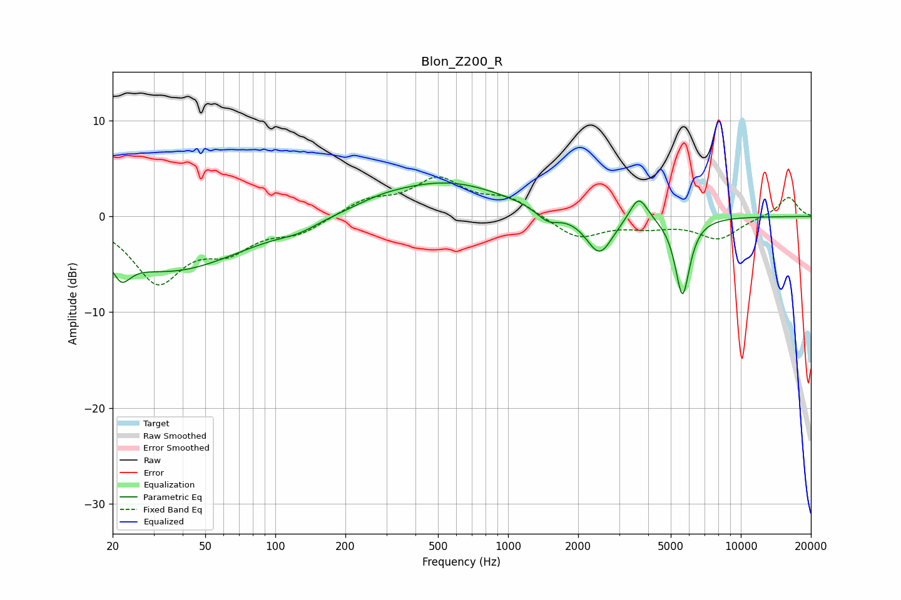

# Blon_Z200_R
See [usage instructions](https://github.com/jaakkopasanen/AutoEq#usage) for more options and info.

### Parametric EQs
Apply preamp of -3.6 dB when using parametric equalizer.

|   # | Type    |   Fc (Hz) |    Q |   Gain (dB) |
|-----|---------|-----------|------|-------------|
|   1 | Peaking |        22 | 4.89 |        -5.6 |
|   2 | Peaking |        22 | 5.65 |         3.4 |
|   3 | Peaking |        35 | 0.45 |        -5.6 |
|   4 | Peaking |       126 | 1.69 |        -0.7 |
|   5 | Peaking |       287 | 1.2  |         0.6 |
|   6 | Peaking |       544 | 0.55 |         3.5 |
|   7 | Peaking |      1484 | 2.82 |        -1.3 |
|   8 | Peaking |      2470 | 2.45 |        -4.2 |
|   9 | Peaking |      3641 | 3.63 |         2.7 |
|  10 | Peaking |      5615 | 4.4  |        -8.2 |

### Fixed Band EQs
When using fixed band (also called graphic) equalizer, apply preamp of **-4.2 dB** (if available) and set gains manually with these parameters.

|   # | Type    |   Fc (Hz) |    Q |   Gain (dB) |
|-----|---------|-----------|------|-------------|
|   1 | Peaking |        31 | 1.41 |        -6.6 |
|   2 | Peaking |        62 | 1.41 |        -2.9 |
|   3 | Peaking |       125 | 1.41 |        -1.6 |
|   4 | Peaking |       250 | 1.41 |         1.6 |
|   5 | Peaking |       500 | 1.41 |         3.7 |
|   6 | Peaking |      1000 | 1.41 |         1.8 |
|   7 | Peaking |      2000 | 1.41 |        -2.3 |
|   8 | Peaking |      4000 | 1.41 |        -0.9 |
|   9 | Peaking |      8000 | 1.41 |        -2.3 |
|  10 | Peaking |     16000 | 1.41 |         2.1 |

### Graphs

