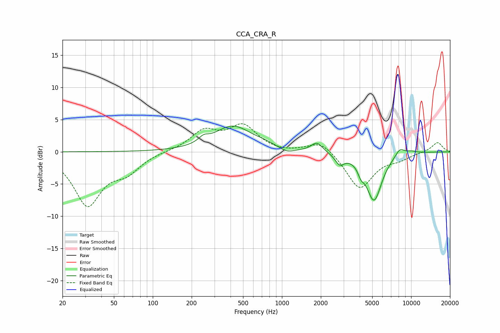

# CCA_CRA_R
See [usage instructions](https://github.com/jaakkopasanen/AutoEq#usage) for more options and info.

### Parametric EQs
Apply preamp of -4.1 dB when using parametric equalizer.

|   # | Type    |   Fc (Hz) |    Q |   Gain (dB) |
|-----|---------|-----------|------|-------------|
|   1 | Peaking |       247 | 3.79 |         0.8 |
|   2 | Peaking |       417 | 0.96 |         3.9 |
|   3 | Peaking |       726 | 2.08 |         0.4 |
|   4 | Peaking |      1098 | 2.65 |        -0.6 |
|   5 | Peaking |      1864 | 3.21 |         1.5 |
|   6 | Peaking |      2800 | 4.05 |        -1.5 |
|   7 | Peaking |      4087 | 6    |        -1.2 |
|   8 | Peaking |      5163 | 2.28 |        -7.5 |
|   9 | Peaking |      8180 | 3.63 |         1.2 |
|  10 | Peaking |     10000 | 2.66 |         0.4 |

### Fixed Band EQs
When using fixed band (also called graphic) equalizer, apply preamp of **-4.5 dB** (if available) and set gains manually with these parameters.

|   # | Type    |   Fc (Hz) |    Q |   Gain (dB) |
|-----|---------|-----------|------|-------------|
|   1 | Peaking |        31 | 1.41 |        -8.1 |
|   2 | Peaking |        62 | 1.41 |        -2.6 |
|   3 | Peaking |       125 | 1.41 |         0.1 |
|   4 | Peaking |       250 | 1.41 |         3.1 |
|   5 | Peaking |       500 | 1.41 |         3.8 |
|   6 | Peaking |      1000 | 1.41 |        -0.2 |
|   7 | Peaking |      2000 | 1.41 |         1.9 |
|   8 | Peaking |      4000 | 1.41 |        -5.8 |
|   9 | Peaking |      8000 | 1.41 |        -0.9 |
|  10 | Peaking |     16000 | 1.41 |         1.5 |

### Graphs

