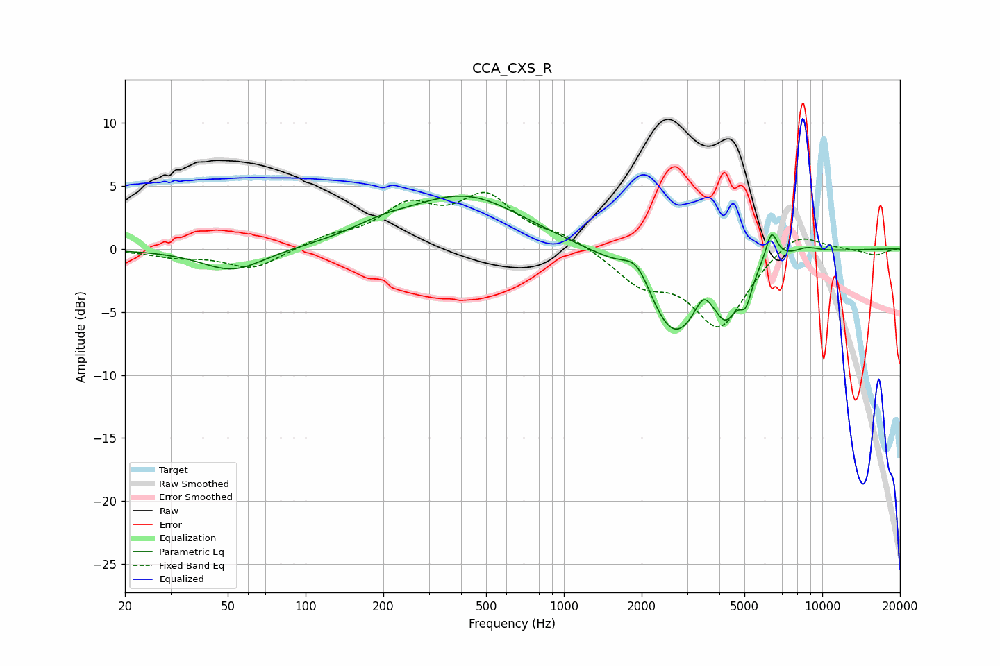

# CCA_CXS_R
See [usage instructions](https://github.com/jaakkopasanen/AutoEq#usage) for more options and info.

### Parametric EQs
Apply preamp of -4.3 dB when using parametric equalizer.

|   # | Type    |   Fc (Hz) |    Q |   Gain (dB) |
|-----|---------|-----------|------|-------------|
|   1 | Peaking |        52 | 1.17 |        -1.8 |
|   2 | Peaking |       196 | 1.2  |         0.8 |
|   3 | Peaking |       416 | 0.62 |         4.1 |
|   4 | Peaking |      1927 | 2.49 |         2.4 |
|   5 | Peaking |      2658 | 1.19 |        -7.2 |
|   6 | Peaking |      3468 | 4.19 |         1.6 |
|   7 | Peaking |      4246 | 3.15 |        -3.1 |
|   8 | Peaking |      5061 | 5.98 |        -2.1 |
|   9 | Peaking |      6364 | 6    |         2.4 |
|  10 | Peaking |      8705 | 2.62 |         0.5 |

### Fixed Band EQs
When using fixed band (also called graphic) equalizer, apply preamp of **-4.6 dB** (if available) and set gains manually with these parameters.

|   # | Type    |   Fc (Hz) |    Q |   Gain (dB) |
|-----|---------|-----------|------|-------------|
|   1 | Peaking |        31 | 1.41 |        -0.5 |
|   2 | Peaking |        62 | 1.41 |        -1.6 |
|   3 | Peaking |       125 | 1.41 |         0.8 |
|   4 | Peaking |       250 | 1.41 |         3   |
|   5 | Peaking |       500 | 1.41 |         3.8 |
|   6 | Peaking |      1000 | 1.41 |         0.9 |
|   7 | Peaking |      2000 | 1.41 |        -2.5 |
|   8 | Peaking |      4000 | 1.41 |        -6   |
|   9 | Peaking |      8000 | 1.41 |         1.7 |
|  10 | Peaking |     16000 | 1.41 |        -0.5 |

### Graphs

