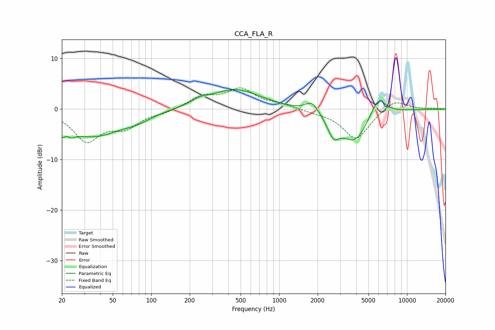

# CCA_FLA_R
See [usage instructions](https://github.com/jaakkopasanen/AutoEq#usage) for more options and info.

### Parametric EQs
Apply preamp of -3.9 dB when using parametric equalizer.

|   # | Type    |   Fc (Hz) |    Q |   Gain (dB) |
|-----|---------|-----------|------|-------------|
|   1 | Peaking |        21 | 3.56 |        -5.2 |
|   2 | Peaking |        22 | 5.89 |         3.2 |
|   3 | Peaking |        36 | 0.66 |        -5.1 |
|   4 | Peaking |        77 | 1.3  |        -1.1 |
|   5 | Peaking |       241 | 2.02 |         0.9 |
|   6 | Peaking |       457 | 0.73 |         3.9 |
|   7 | Peaking |      1806 | 2.93 |         2.1 |
|   8 | Peaking |      2660 | 3.15 |        -3.6 |
|   9 | Peaking |      3890 | 1.28 |        -6.4 |
|  10 | Peaking |      5923 | 2.21 |         4.1 |

### Fixed Band EQs
When using fixed band (also called graphic) equalizer, apply preamp of **-4.3 dB** (if available) and set gains manually with these parameters.

|   # | Type    |   Fc (Hz) |    Q |   Gain (dB) |
|-----|---------|-----------|------|-------------|
|   1 | Peaking |        31 | 1.41 |        -6   |
|   2 | Peaking |        62 | 1.41 |        -3.2 |
|   3 | Peaking |       125 | 1.41 |        -0.6 |
|   4 | Peaking |       250 | 1.41 |         2.4 |
|   5 | Peaking |       500 | 1.41 |         3.8 |
|   6 | Peaking |      1000 | 1.41 |         0.8 |
|   7 | Peaking |      2000 | 1.41 |        -0.5 |
|   8 | Peaking |      4000 | 1.41 |        -6   |
|   9 | Peaking |      8000 | 1.41 |         2.1 |
|  10 | Peaking |     16000 | 1.41 |         0.1 |

### Graphs

