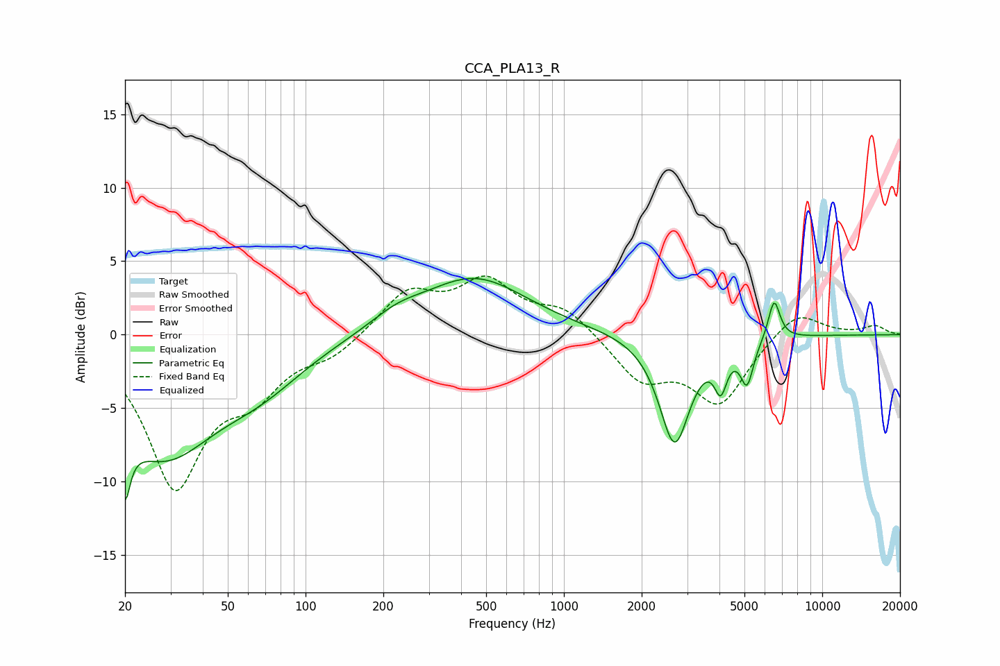

# CCA_PLA13_R
See [usage instructions](https://github.com/jaakkopasanen/AutoEq#usage) for more options and info.

### Parametric EQs
Apply preamp of -3.9 dB when using parametric equalizer.

|   # | Type    |   Fc (Hz) |    Q |   Gain (dB) |
|-----|---------|-----------|------|-------------|
|   1 | Peaking |        20 | 5.41 |        -8.6 |
|   2 | Peaking |        20 | 4.92 |         3.9 |
|   3 | Peaking |        28 | 0.68 |        -7.8 |
|   4 | Peaking |        68 | 0.82 |        -2.2 |
|   5 | Peaking |       225 | 1.4  |         0.9 |
|   6 | Peaking |       450 | 0.69 |         3.9 |
|   7 | Peaking |      2682 | 2.38 |        -7.4 |
|   8 | Peaking |      4048 | 5.87 |        -2.6 |
|   9 | Peaking |      5114 | 5.58 |        -2.8 |
|  10 | Peaking |      6512 | 5.99 |         2.8 |

### Fixed Band EQs
When using fixed band (also called graphic) equalizer, apply preamp of **-4.1 dB** (if available) and set gains manually with these parameters.

|   # | Type    |   Fc (Hz) |    Q |   Gain (dB) |
|-----|---------|-----------|------|-------------|
|   1 | Peaking |        31 | 1.41 |       -10   |
|   2 | Peaking |        62 | 1.41 |        -3.1 |
|   3 | Peaking |       125 | 1.41 |        -1.2 |
|   4 | Peaking |       250 | 1.41 |         2.9 |
|   5 | Peaking |       500 | 1.41 |         3.4 |
|   6 | Peaking |      1000 | 1.41 |         1.7 |
|   7 | Peaking |      2000 | 1.41 |        -3   |
|   8 | Peaking |      4000 | 1.41 |        -4.5 |
|   9 | Peaking |      8000 | 1.41 |         1.8 |
|  10 | Peaking |     16000 | 1.41 |         0.6 |

### Graphs

