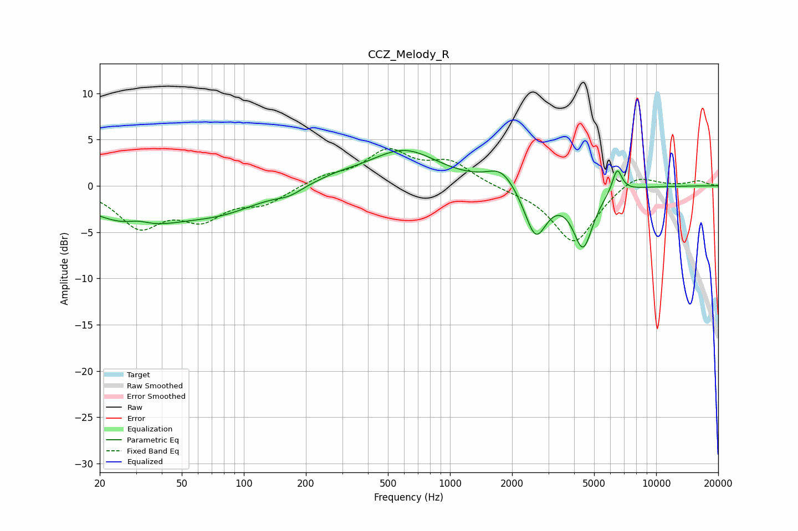

# CCZ_Melody_R
See [usage instructions](https://github.com/jaakkopasanen/AutoEq#usage) for more options and info.

### Parametric EQs
Apply preamp of -3.9 dB when using parametric equalizer.

|   # | Type    |   Fc (Hz) |    Q |   Gain (dB) |
|-----|---------|-----------|------|-------------|
|   1 | Peaking |        30 | 0.62 |        -3.9 |
|   2 | Peaking |        31 | 2.54 |         0.6 |
|   3 | Peaking |        79 | 0.74 |        -2   |
|   4 | Peaking |       166 | 2.26 |        -0.7 |
|   5 | Peaking |       281 | 1.13 |         0.7 |
|   6 | Peaking |       598 | 0.84 |         3.8 |
|   7 | Peaking |      1779 | 2.05 |         1.9 |
|   8 | Peaking |      2603 | 2.59 |        -5.5 |
|   9 | Peaking |      4420 | 2.88 |        -6.3 |
|  10 | Peaking |      6467 | 5.83 |         2.6 |

### Fixed Band EQs
When using fixed band (also called graphic) equalizer, apply preamp of **-4.1 dB** (if available) and set gains manually with these parameters.

|   # | Type    |   Fc (Hz) |    Q |   Gain (dB) |
|-----|---------|-----------|------|-------------|
|   1 | Peaking |        31 | 1.41 |        -4.2 |
|   2 | Peaking |        62 | 1.41 |        -3.1 |
|   3 | Peaking |       125 | 1.41 |        -1.7 |
|   4 | Peaking |       250 | 1.41 |         0.9 |
|   5 | Peaking |       500 | 1.41 |         3.6 |
|   6 | Peaking |      1000 | 1.41 |         2.4 |
|   7 | Peaking |      2000 | 1.41 |        -0.3 |
|   8 | Peaking |      4000 | 1.41 |        -6.2 |
|   9 | Peaking |      8000 | 1.41 |         1.5 |
|  10 | Peaking |     16000 | 1.41 |         0.5 |

### Graphs

