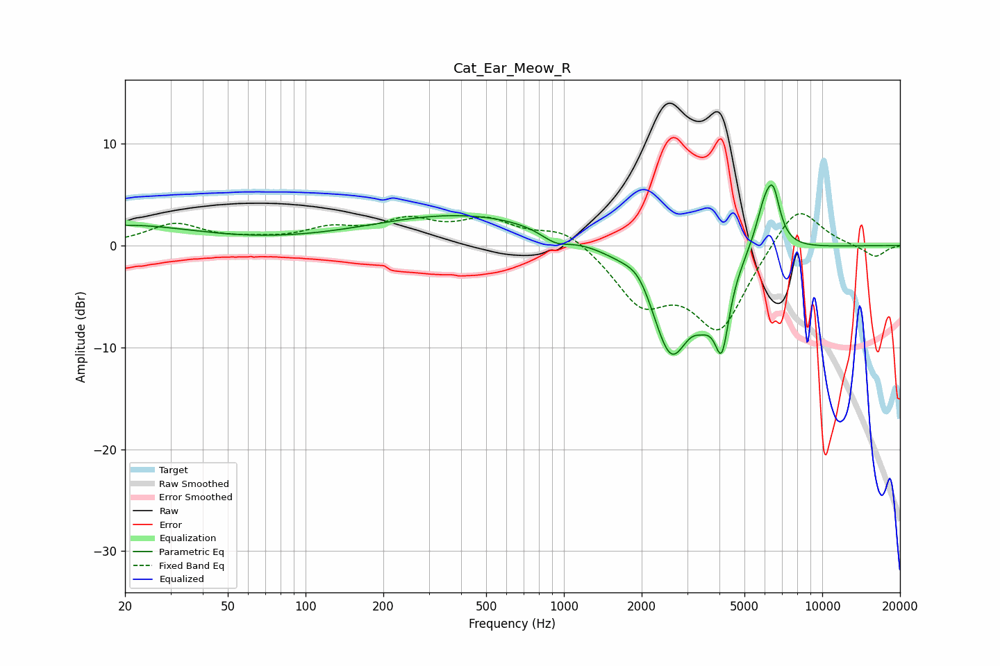

# Cat_Ear_Meow_R
See [usage instructions](https://github.com/jaakkopasanen/AutoEq#usage) for more options and info.

### Parametric EQs
Apply preamp of -6.1 dB when using parametric equalizer.

|   # | Type    |   Fc (Hz) |    Q |   Gain (dB) |
|-----|---------|-----------|------|-------------|
|   1 | Peaking |        20 | 0.53 |         1.9 |
|   2 | Peaking |       416 | 0.39 |         3.1 |
|   3 | Peaking |       928 | 2.48 |        -1.1 |
|   4 | Peaking |      1964 | 2.49 |         1.9 |
|   5 | Peaking |      2595 | 1.64 |       -11.2 |
|   6 | Peaking |      3410 | 4.18 |        -1.5 |
|   7 | Peaking |      3695 | 4.58 |        -0.7 |
|   8 | Peaking |      4089 | 4.9  |        -7.2 |
|   9 | Peaking |      6014 | 3.48 |         4.6 |
|  10 | Peaking |      6477 | 5.41 |         3.6 |

### Fixed Band EQs
When using fixed band (also called graphic) equalizer, apply preamp of **-3.2 dB** (if available) and set gains manually with these parameters.

|   # | Type    |   Fc (Hz) |    Q |   Gain (dB) |
|-----|---------|-----------|------|-------------|
|   1 | Peaking |        31 | 1.41 |         2   |
|   2 | Peaking |        62 | 1.41 |         0.4 |
|   3 | Peaking |       125 | 1.41 |         1.4 |
|   4 | Peaking |       250 | 1.41 |         2.2 |
|   5 | Peaking |       500 | 1.41 |         2.2 |
|   6 | Peaking |      1000 | 1.41 |         1.8 |
|   7 | Peaking |      2000 | 1.41 |        -5.2 |
|   8 | Peaking |      4000 | 1.41 |        -8   |
|   9 | Peaking |      8000 | 1.41 |         4.5 |
|  10 | Peaking |     16000 | 1.41 |        -1.2 |

### Graphs

