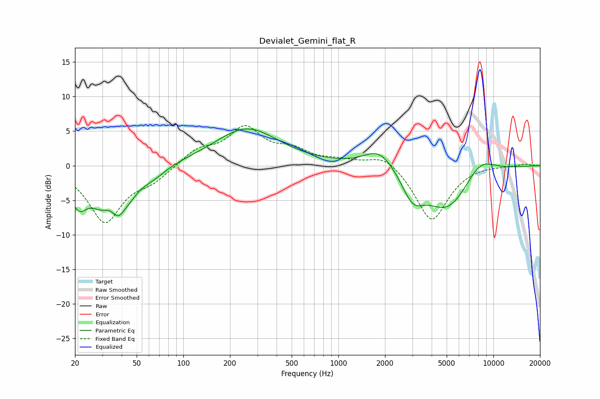

# Devialet_Gemini_flat_R
See [usage instructions](https://github.com/jaakkopasanen/AutoEq#usage) for more options and info.

### Parametric EQs
Apply preamp of -5.4 dB when using parametric equalizer.

|   # | Type    |   Fc (Hz) |    Q |   Gain (dB) |
|-----|---------|-----------|------|-------------|
|   1 | Peaking |        21 | 2.35 |        -5   |
|   2 | Peaking |        29 | 2.09 |        -3.5 |
|   3 | Peaking |        38 | 3.07 |        -3.5 |
|   4 | Peaking |        45 | 2.18 |        -2.3 |
|   5 | Peaking |        63 | 1.62 |        -1.5 |
|   6 | Peaking |       257 | 0.68 |         5.4 |
|   7 | Peaking |      1853 | 1.4  |         3   |
|   8 | Peaking |      3017 | 2.02 |        -3.7 |
|   9 | Peaking |      5072 | 0.9  |        -6.5 |
|  10 | Peaking |      8140 | 1.32 |         2.9 |

### Fixed Band EQs
When using fixed band (also called graphic) equalizer, apply preamp of **-5.9 dB** (if available) and set gains manually with these parameters.

|   # | Type    |   Fc (Hz) |    Q |   Gain (dB) |
|-----|---------|-----------|------|-------------|
|   1 | Peaking |        31 | 1.41 |        -8   |
|   2 | Peaking |        62 | 1.41 |        -1.8 |
|   3 | Peaking |       125 | 1.41 |         2.2 |
|   4 | Peaking |       250 | 1.41 |         5.2 |
|   5 | Peaking |       500 | 1.41 |         1.9 |
|   6 | Peaking |      1000 | 1.41 |         0.6 |
|   7 | Peaking |      2000 | 1.41 |         1.9 |
|   8 | Peaking |      4000 | 1.41 |        -8.1 |
|   9 | Peaking |      8000 | 1.41 |         0.2 |
|  10 | Peaking |     16000 | 1.41 |         0.3 |

### Graphs

