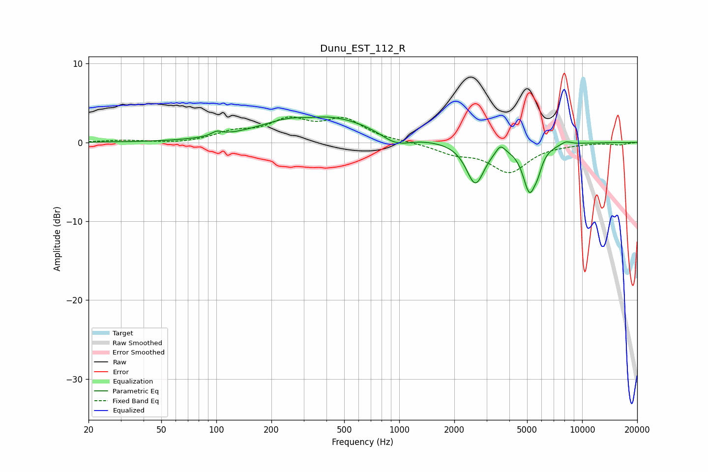

# Dunu_EST_112_R
See [usage instructions](https://github.com/jaakkopasanen/AutoEq#usage) for more options and info.

### Parametric EQs
Apply preamp of -3.3 dB when using parametric equalizer.

|   # | Type    |   Fc (Hz) |    Q |   Gain (dB) |
|-----|---------|-----------|------|-------------|
|   1 | Peaking |       101 | 4.92 |         0.6 |
|   2 | Peaking |       260 | 0.9  |         0.8 |
|   3 | Peaking |       319 | 1.9  |        -0.4 |
|   4 | Peaking |       398 | 0.49 |         3.1 |
|   5 | Peaking |       956 | 1.68 |        -1.5 |
|   6 | Peaking |      2607 | 2.87 |        -5.2 |
|   7 | Peaking |      3576 | 5.92 |         1.1 |
|   8 | Peaking |      5154 | 3.85 |        -5.8 |
|   9 | Peaking |      5724 | 6    |        -1.3 |
|  10 | Peaking |      8149 | 4.48 |         0.4 |

### Fixed Band EQs
When using fixed band (also called graphic) equalizer, apply preamp of **-3.3 dB** (if available) and set gains manually with these parameters.

|   # | Type    |   Fc (Hz) |    Q |   Gain (dB) |
|-----|---------|-----------|------|-------------|
|   1 | Peaking |        31 | 1.41 |         0.2 |
|   2 | Peaking |        62 | 1.41 |        -0.2 |
|   3 | Peaking |       125 | 1.41 |         1.1 |
|   4 | Peaking |       250 | 1.41 |         2.5 |
|   5 | Peaking |       500 | 1.41 |         2.7 |
|   6 | Peaking |      1000 | 1.41 |         0.1 |
|   7 | Peaking |      2000 | 1.41 |        -1.2 |
|   8 | Peaking |      4000 | 1.41 |        -3.6 |
|   9 | Peaking |      8000 | 1.41 |        -0.1 |
|  10 | Peaking |     16000 | 1.41 |        -0.3 |

### Graphs

