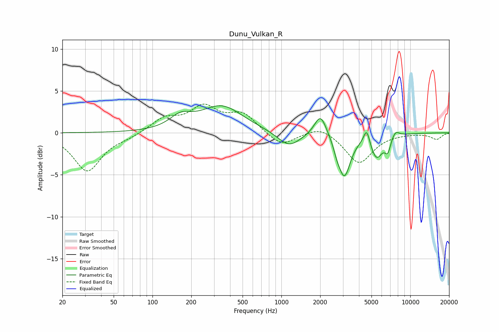

# Dunu_Vulkan_R
See [usage instructions](https://github.com/jaakkopasanen/AutoEq#usage) for more options and info.

### Parametric EQs
Apply preamp of -3.3 dB when using parametric equalizer.

|   # | Type    |   Fc (Hz) |    Q |   Gain (dB) |
|-----|---------|-----------|------|-------------|
|   1 | Peaking |       165 | 1.69 |         1.4 |
|   2 | Peaking |       345 | 0.86 |         3.1 |
|   3 | Peaking |      1147 | 1.62 |        -1.8 |
|   4 | Peaking |      2013 | 3.03 |         2.7 |
|   5 | Peaking |      2698 | 6    |        -0.7 |
|   6 | Peaking |      3078 | 2.98 |        -5.1 |
|   7 | Peaking |      4587 | 6    |         1.9 |
|   8 | Peaking |      5477 | 2.94 |        -2.8 |
|   9 | Peaking |      6682 | 6    |        -1.6 |
|  10 | Peaking |      7672 | 4.72 |         0.8 |

### Fixed Band EQs
When using fixed band (also called graphic) equalizer, apply preamp of **-3.5 dB** (if available) and set gains manually with these parameters.

|   # | Type    |   Fc (Hz) |    Q |   Gain (dB) |
|-----|---------|-----------|------|-------------|
|   1 | Peaking |        31 | 1.41 |        -4.5 |
|   2 | Peaking |        62 | 1.41 |        -0.4 |
|   3 | Peaking |       125 | 1.41 |         1.6 |
|   4 | Peaking |       250 | 1.41 |         2.8 |
|   5 | Peaking |       500 | 1.41 |         2.2 |
|   6 | Peaking |      1000 | 1.41 |        -1.7 |
|   7 | Peaking |      2000 | 1.41 |         1   |
|   8 | Peaking |      4000 | 1.41 |        -3.6 |
|   9 | Peaking |      8000 | 1.41 |        -0   |
|  10 | Peaking |     16000 | 1.41 |        -0.8 |

### Graphs

