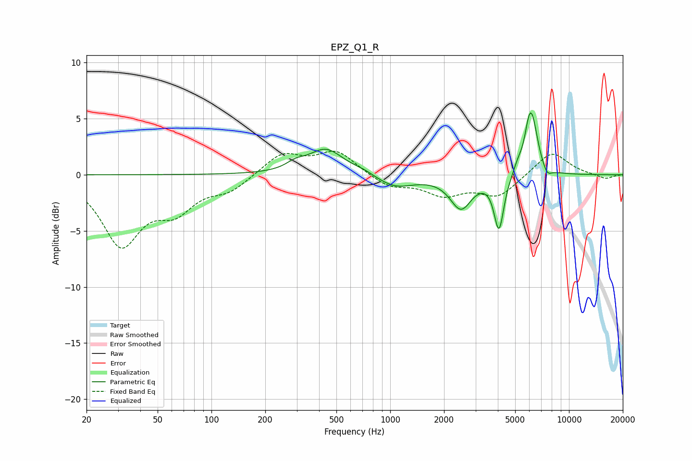

# EPZ_Q1_R
See [usage instructions](https://github.com/jaakkopasanen/AutoEq#usage) for more options and info.

### Parametric EQs
Apply preamp of -5.6 dB when using parametric equalizer.

|   # | Type    |   Fc (Hz) |    Q |   Gain (dB) |
|-----|---------|-----------|------|-------------|
|   1 | Peaking |       295 | 2.82 |         0.5 |
|   2 | Peaking |       436 | 1.44 |         2.3 |
|   3 | Peaking |       703 | 2.21 |         0.3 |
|   4 | Peaking |      1065 | 1.34 |        -1.1 |
|   5 | Peaking |      2486 | 2.35 |        -2.9 |
|   6 | Peaking |      4059 | 5.18 |        -4.8 |
|   7 | Peaking |      5177 | 5.41 |         0.7 |
|   8 | Peaking |      5955 | 5.95 |         1.7 |
|   9 | Peaking |      6223 | 4.03 |         4.4 |
|  10 | Peaking |      7541 | 5.37 |        -0.8 |

### Fixed Band EQs
When using fixed band (also called graphic) equalizer, apply preamp of **-2.2 dB** (if available) and set gains manually with these parameters.

|   # | Type    |   Fc (Hz) |    Q |   Gain (dB) |
|-----|---------|-----------|------|-------------|
|   1 | Peaking |        31 | 1.41 |        -6   |
|   2 | Peaking |        62 | 1.41 |        -2.7 |
|   3 | Peaking |       125 | 1.41 |        -1.3 |
|   4 | Peaking |       250 | 1.41 |         1.9 |
|   5 | Peaking |       500 | 1.41 |         2.1 |
|   6 | Peaking |      1000 | 1.41 |        -1.1 |
|   7 | Peaking |      2000 | 1.41 |        -1.6 |
|   8 | Peaking |      4000 | 1.41 |        -1.9 |
|   9 | Peaking |      8000 | 1.41 |         2.1 |
|  10 | Peaking |     16000 | 1.41 |        -0.4 |

### Graphs

