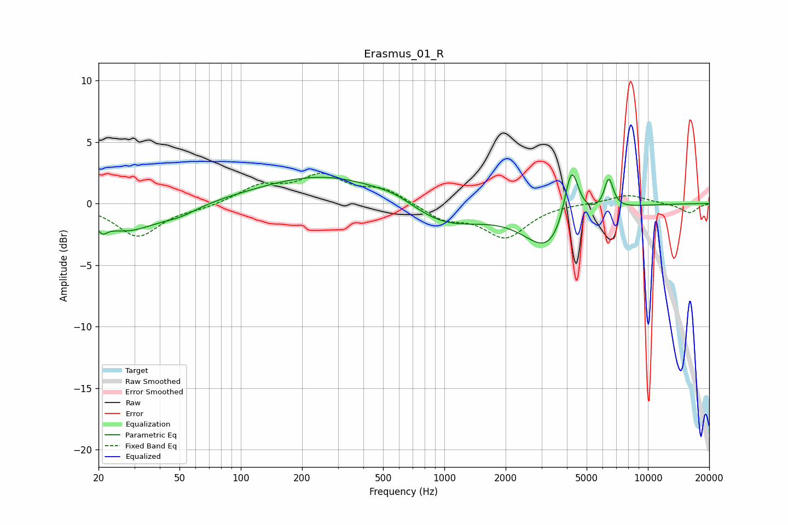

# Erasmus_01_R
See [usage instructions](https://github.com/jaakkopasanen/AutoEq#usage) for more options and info.

### Parametric EQs
Apply preamp of -2.4 dB when using parametric equalizer.

|   # | Type    |   Fc (Hz) |    Q |   Gain (dB) |
|-----|---------|-----------|------|-------------|
|   1 | Peaking |        21 | 5.99 |         1.5 |
|   2 | Peaking |        21 | 5.93 |        -2.3 |
|   3 | Peaking |        27 | 0.92 |        -2.2 |
|   4 | Peaking |        50 | 1.59 |        -0.6 |
|   5 | Peaking |       266 | 0.44 |         2.4 |
|   6 | Peaking |       584 | 1.41 |         0.5 |
|   7 | Peaking |       975 | 0.71 |        -2.1 |
|   8 | Peaking |      3269 | 1.21 |        -3.7 |
|   9 | Peaking |      4208 | 3.88 |         5   |
|  10 | Peaking |      6423 | 6    |         2.5 |

### Fixed Band EQs
When using fixed band (also called graphic) equalizer, apply preamp of **-2.6 dB** (if available) and set gains manually with these parameters.

|   # | Type    |   Fc (Hz) |    Q |   Gain (dB) |
|-----|---------|-----------|------|-------------|
|   1 | Peaking |        31 | 1.41 |        -2.7 |
|   2 | Peaking |        62 | 1.41 |        -0.3 |
|   3 | Peaking |       125 | 1.41 |         1.3 |
|   4 | Peaking |       250 | 1.41 |         2.1 |
|   5 | Peaking |       500 | 1.41 |         1.1 |
|   6 | Peaking |      1000 | 1.41 |        -1.2 |
|   7 | Peaking |      2000 | 1.41 |        -2.7 |
|   8 | Peaking |      4000 | 1.41 |         0   |
|   9 | Peaking |      8000 | 1.41 |         0.7 |
|  10 | Peaking |     16000 | 1.41 |        -0.8 |

### Graphs

