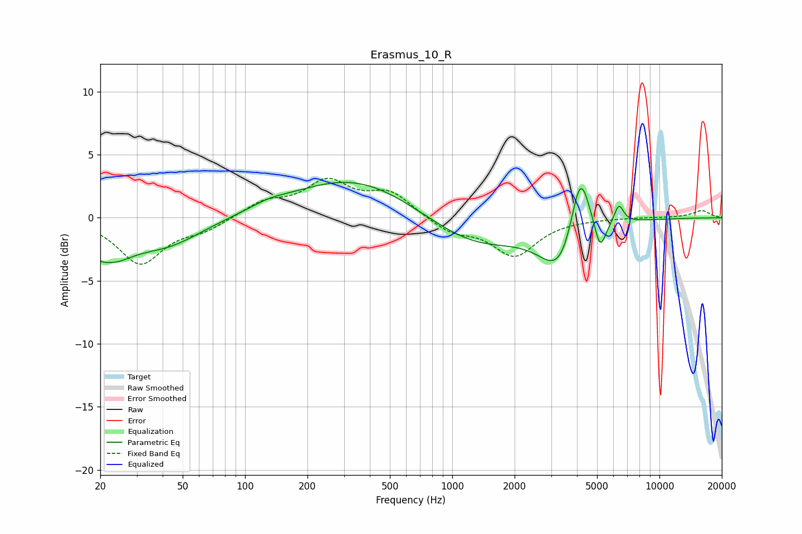

# Erasmus_10_R
See [usage instructions](https://github.com/jaakkopasanen/AutoEq#usage) for more options and info.

### Parametric EQs
Apply preamp of -2.9 dB when using parametric equalizer.

|   # | Type    |   Fc (Hz) |    Q |   Gain (dB) |
|-----|---------|-----------|------|-------------|
|   1 | Peaking |        20 | 5.73 |        -0.4 |
|   2 | Peaking |        22 | 1.3  |        -2.6 |
|   3 | Peaking |        42 | 0.83 |        -1.9 |
|   4 | Peaking |       130 | 1.58 |         0.4 |
|   5 | Peaking |       335 | 0.48 |         3.2 |
|   6 | Peaking |      1281 | 0.61 |        -2.4 |
|   7 | Peaking |      3349 | 1.47 |        -4.1 |
|   8 | Peaking |      4142 | 2.98 |         5.9 |
|   9 | Peaking |      5176 | 5.18 |        -2.4 |
|  10 | Peaking |      6375 | 6    |         1.5 |

### Fixed Band EQs
When using fixed band (also called graphic) equalizer, apply preamp of **-3.2 dB** (if available) and set gains manually with these parameters.

|   # | Type    |   Fc (Hz) |    Q |   Gain (dB) |
|-----|---------|-----------|------|-------------|
|   1 | Peaking |        31 | 1.41 |        -3.6 |
|   2 | Peaking |        62 | 1.41 |        -0.9 |
|   3 | Peaking |       125 | 1.41 |         1.2 |
|   4 | Peaking |       250 | 1.41 |         2.7 |
|   5 | Peaking |       500 | 1.41 |         1.9 |
|   6 | Peaking |      1000 | 1.41 |        -1.1 |
|   7 | Peaking |      2000 | 1.41 |        -2.9 |
|   8 | Peaking |      4000 | 1.41 |        -0   |
|   9 | Peaking |      8000 | 1.41 |         0   |
|  10 | Peaking |     16000 | 1.41 |         0.6 |

### Graphs

