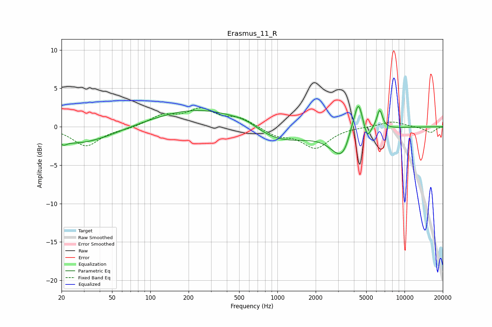

# Erasmus_11_R
See [usage instructions](https://github.com/jaakkopasanen/AutoEq#usage) for more options and info.

### Parametric EQs
Apply preamp of -2.7 dB when using parametric equalizer.

|   # | Type    |   Fc (Hz) |    Q |   Gain (dB) |
|-----|---------|-----------|------|-------------|
|   1 | Peaking |        21 | 5.93 |        -0.5 |
|   2 | Peaking |        27 | 0.54 |        -2.2 |
|   3 | Peaking |       287 | 0.35 |         2.7 |
|   4 | Peaking |       570 | 1.44 |         0.6 |
|   5 | Peaking |       967 | 0.56 |        -2.6 |
|   6 | Peaking |      3243 | 1.6  |        -3.8 |
|   7 | Peaking |      3796 | 4.53 |         1.1 |
|   8 | Peaking |      4327 | 4.13 |         4.6 |
|   9 | Peaking |      5100 | 5.99 |        -1.5 |
|  10 | Peaking |      6371 | 6    |         2.5 |

### Fixed Band EQs
When using fixed band (also called graphic) equalizer, apply preamp of **-2.6 dB** (if available) and set gains manually with these parameters.

|   # | Type    |   Fc (Hz) |    Q |   Gain (dB) |
|-----|---------|-----------|------|-------------|
|   1 | Peaking |        31 | 1.41 |        -2.5 |
|   2 | Peaking |        62 | 1.41 |        -0.2 |
|   3 | Peaking |       125 | 1.41 |         1.4 |
|   4 | Peaking |       250 | 1.41 |         2.1 |
|   5 | Peaking |       500 | 1.41 |         1.1 |
|   6 | Peaking |      1000 | 1.41 |        -1.1 |
|   7 | Peaking |      2000 | 1.41 |        -2.7 |
|   8 | Peaking |      4000 | 1.41 |         0   |
|   9 | Peaking |      8000 | 1.41 |         0.7 |
|  10 | Peaking |     16000 | 1.41 |        -0.8 |

### Graphs

