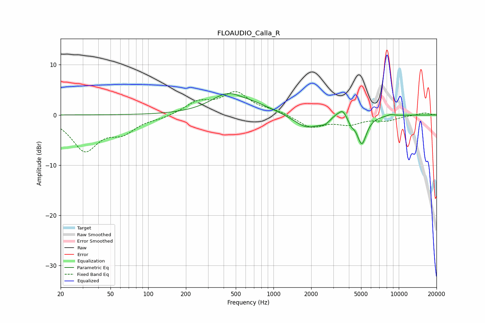

# FLOAUDIO_Calla_R
See [usage instructions](https://github.com/jaakkopasanen/AutoEq#usage) for more options and info.

### Parametric EQs
Apply preamp of -4.4 dB when using parametric equalizer.

|   # | Type    |   Fc (Hz) |    Q |   Gain (dB) |
|-----|---------|-----------|------|-------------|
|   1 | Peaking |       442 | 0.99 |         4.1 |
|   2 | Peaking |       536 | 2.06 |        -0.3 |
|   3 | Peaking |       742 | 0.96 |         1   |
|   4 | Peaking |      1851 | 1.4  |        -2.7 |
|   5 | Peaking |      2573 | 3.51 |        -0.9 |
|   6 | Peaking |      3146 | 3.52 |         0.6 |
|   7 | Peaking |      3572 | 4.48 |         1.7 |
|   8 | Peaking |      4165 | 6    |        -1   |
|   9 | Peaking |      5070 | 3.66 |        -5.6 |
|  10 | Peaking |      8639 | 4.1  |         0.3 |

### Fixed Band EQs
When using fixed band (also called graphic) equalizer, apply preamp of **-4.8 dB** (if available) and set gains manually with these parameters.

|   # | Type    |   Fc (Hz) |    Q |   Gain (dB) |
|-----|---------|-----------|------|-------------|
|   1 | Peaking |        31 | 1.41 |        -6.8 |
|   2 | Peaking |        62 | 1.41 |        -3   |
|   3 | Peaking |       125 | 1.41 |        -0.5 |
|   4 | Peaking |       250 | 1.41 |         2.4 |
|   5 | Peaking |       500 | 1.41 |         4.2 |
|   6 | Peaking |      1000 | 1.41 |         0.7 |
|   7 | Peaking |      2000 | 1.41 |        -2.4 |
|   8 | Peaking |      4000 | 1.41 |        -1.6 |
|   9 | Peaking |      8000 | 1.41 |        -1   |
|  10 | Peaking |     16000 | 1.41 |         0.5 |

### Graphs

