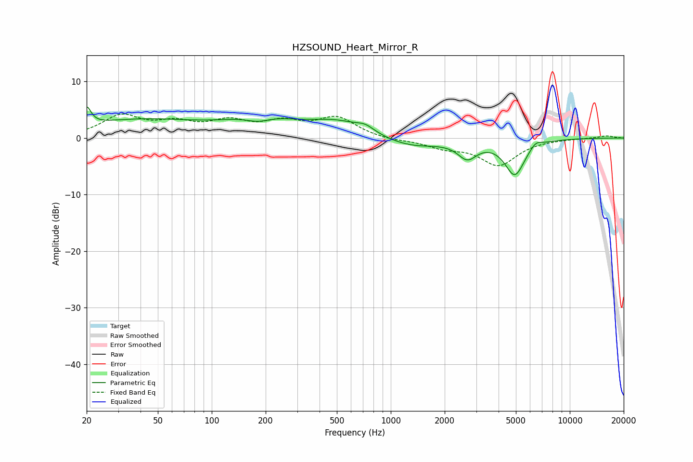

# HZSOUND_Heart_Mirror_R
See [usage instructions](https://github.com/jaakkopasanen/AutoEq#usage) for more options and info.

### Parametric EQs
Apply preamp of -5.6 dB when using parametric equalizer.

|   # | Type    |   Fc (Hz) |    Q |   Gain (dB) |
|-----|---------|-----------|------|-------------|
|   1 | Peaking |        20 | 5.99 |         3.1 |
|   2 | Peaking |        39 | 0.4  |         3.1 |
|   3 | Peaking |       182 | 1.87 |        -1.4 |
|   4 | Peaking |       191 | 0.76 |         3.2 |
|   5 | Peaking |       500 | 0.9  |         2.5 |
|   6 | Peaking |       720 | 2.8  |         1.1 |
|   7 | Peaking |      1296 | 0.9  |        -1.7 |
|   8 | Peaking |      2677 | 2.69 |        -3   |
|   9 | Peaking |      4930 | 2.49 |        -6.3 |
|  10 | Peaking |      6451 | 4.24 |         1   |

### Fixed Band EQs
When using fixed band (also called graphic) equalizer, apply preamp of **-4.3 dB** (if available) and set gains manually with these parameters.

|   # | Type    |   Fc (Hz) |    Q |   Gain (dB) |
|-----|---------|-----------|------|-------------|
|   1 | Peaking |        31 | 1.41 |         3.7 |
|   2 | Peaking |        62 | 1.41 |         2.2 |
|   3 | Peaking |       125 | 1.41 |         2.5 |
|   4 | Peaking |       250 | 1.41 |         2.4 |
|   5 | Peaking |       500 | 1.41 |         3.4 |
|   6 | Peaking |      1000 | 1.41 |        -0.4 |
|   7 | Peaking |      2000 | 1.41 |        -1.5 |
|   8 | Peaking |      4000 | 1.41 |        -4.7 |
|   9 | Peaking |      8000 | 1.41 |        -0.1 |
|  10 | Peaking |     16000 | 1.41 |         0.4 |

### Graphs

