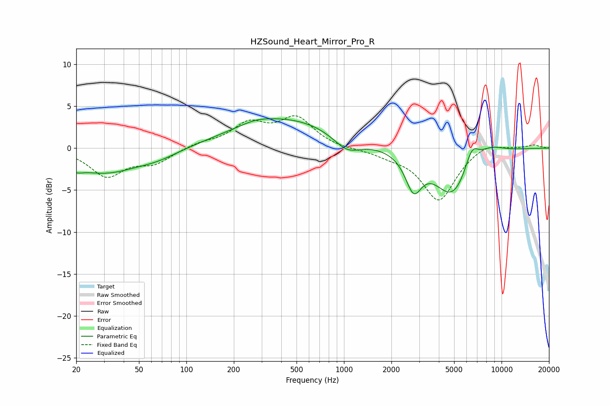

# HZSound_Heart_Mirror_Pro_R
See [usage instructions](https://github.com/jaakkopasanen/AutoEq#usage) for more options and info.

### Parametric EQs
Apply preamp of -3.6 dB when using parametric equalizer.

|   # | Type    |   Fc (Hz) |    Q |   Gain (dB) |
|-----|---------|-----------|------|-------------|
|   1 | Peaking |        20 | 3.66 |        -0.7 |
|   2 | Peaking |        30 | 0.65 |        -2.8 |
|   3 | Peaking |        66 | 1.01 |        -0.8 |
|   4 | Peaking |       276 | 1.55 |         0.4 |
|   5 | Peaking |       429 | 0.41 |         3.5 |
|   6 | Peaking |      1046 | 1.58 |        -1.9 |
|   7 | Peaking |      2765 | 2.77 |        -4.1 |
|   8 | Peaking |      4890 | 1.2  |        -5.7 |
|   9 | Peaking |      6469 | 3.06 |         2.7 |
|  10 | Peaking |      8427 | 1.5  |         1.1 |

### Fixed Band EQs
When using fixed band (also called graphic) equalizer, apply preamp of **-3.9 dB** (if available) and set gains manually with these parameters.

|   # | Type    |   Fc (Hz) |    Q |   Gain (dB) |
|-----|---------|-----------|------|-------------|
|   1 | Peaking |        31 | 1.41 |        -3.2 |
|   2 | Peaking |        62 | 1.41 |        -1.6 |
|   3 | Peaking |       125 | 1.41 |         0.6 |
|   4 | Peaking |       250 | 1.41 |         2.7 |
|   5 | Peaking |       500 | 1.41 |         3.4 |
|   6 | Peaking |      1000 | 1.41 |        -0.2 |
|   7 | Peaking |      2000 | 1.41 |        -0.7 |
|   8 | Peaking |      4000 | 1.41 |        -6.2 |
|   9 | Peaking |      8000 | 1.41 |         0.8 |
|  10 | Peaking |     16000 | 1.41 |         0.4 |

### Graphs

