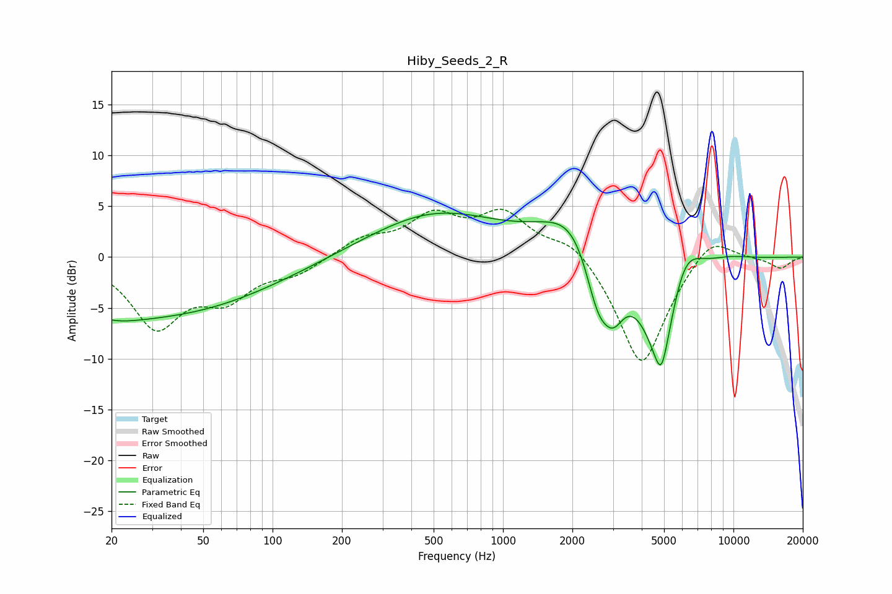

# Hiby_Seeds_2_R
See [usage instructions](https://github.com/jaakkopasanen/AutoEq#usage) for more options and info.

### Parametric EQs
Apply preamp of -4.4 dB when using parametric equalizer.

|   # | Type    |   Fc (Hz) |    Q |   Gain (dB) |
|-----|---------|-----------|------|-------------|
|   1 | Peaking |        20 | 1.23 |        -0.8 |
|   2 | Peaking |        30 | 0.27 |        -5.7 |
|   3 | Peaking |       507 | 0.49 |         4.3 |
|   4 | Peaking |      2148 | 1    |         5.5 |
|   5 | Peaking |      2575 | 2.27 |        -6.8 |
|   6 | Peaking |      3014 | 2.83 |        -3.8 |
|   7 | Peaking |      4853 | 1.58 |       -11.4 |
|   8 | Peaking |      4862 | 5.66 |        -2.3 |
|   9 | Peaking |      6073 | 1.83 |         5.1 |
|  10 | Peaking |      9422 | 1.26 |         0.5 |

### Fixed Band EQs
When using fixed band (also called graphic) equalizer, apply preamp of **-4.8 dB** (if available) and set gains manually with these parameters.

|   # | Type    |   Fc (Hz) |    Q |   Gain (dB) |
|-----|---------|-----------|------|-------------|
|   1 | Peaking |        31 | 1.41 |        -6.6 |
|   2 | Peaking |        62 | 1.41 |        -3.5 |
|   3 | Peaking |       125 | 1.41 |        -1.5 |
|   4 | Peaking |       250 | 1.41 |         1.7 |
|   5 | Peaking |       500 | 1.41 |         3.7 |
|   6 | Peaking |      1000 | 1.41 |         4   |
|   7 | Peaking |      2000 | 1.41 |         2.1 |
|   8 | Peaking |      4000 | 1.41 |       -11.1 |
|   9 | Peaking |      8000 | 1.41 |         2.7 |
|  10 | Peaking |     16000 | 1.41 |        -1.1 |

### Graphs

