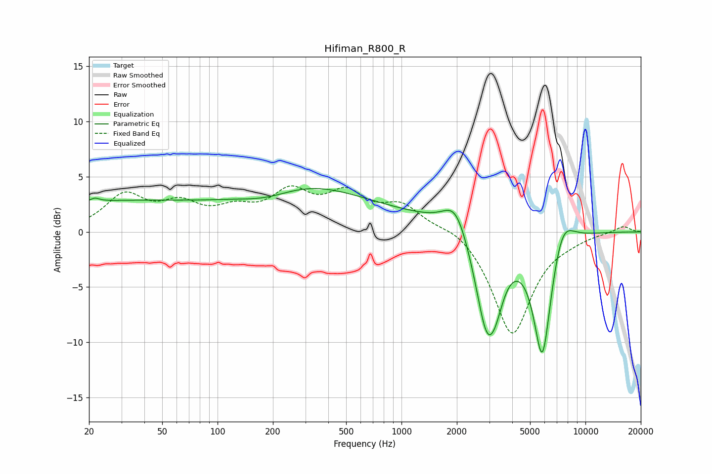

# Hifiman_R800_R
See [usage instructions](https://github.com/jaakkopasanen/AutoEq#usage) for more options and info.

### Parametric EQs
Apply preamp of -4.0 dB when using parametric equalizer.

|   # | Type    |   Fc (Hz) |    Q |   Gain (dB) |
|-----|---------|-----------|------|-------------|
|   1 | Peaking |        22 | 5.98 |         0.3 |
|   2 | Peaking |        25 | 0.27 |         2.6 |
|   3 | Peaking |       186 | 0.89 |        -1.2 |
|   4 | Peaking |       260 | 0.42 |         3.4 |
|   5 | Peaking |       963 | 0.18 |         1.3 |
|   6 | Peaking |      1975 | 2.1  |         2.9 |
|   7 | Peaking |      2917 | 2.08 |        -9.4 |
|   8 | Peaking |      3264 | 3.37 |        -1.6 |
|   9 | Peaking |      5834 | 2.67 |       -11.8 |
|  10 | Peaking |      7465 | 2.17 |         3   |

### Fixed Band EQs
When using fixed band (also called graphic) equalizer, apply preamp of **-4.3 dB** (if available) and set gains manually with these parameters.

|   # | Type    |   Fc (Hz) |    Q |   Gain (dB) |
|-----|---------|-----------|------|-------------|
|   1 | Peaking |        31 | 1.41 |         3.1 |
|   2 | Peaking |        62 | 1.41 |         2.1 |
|   3 | Peaking |       125 | 1.41 |         1.6 |
|   4 | Peaking |       250 | 1.41 |         3.2 |
|   5 | Peaking |       500 | 1.41 |         3   |
|   6 | Peaking |      1000 | 1.41 |         2.2 |
|   7 | Peaking |      2000 | 1.41 |         0.8 |
|   8 | Peaking |      4000 | 1.41 |        -9.3 |
|   9 | Peaking |      8000 | 1.41 |        -0.3 |
|  10 | Peaking |     16000 | 1.41 |         0.6 |

### Graphs

